# Pemrograman Mobile
## Praktikum Week 2 - Responsive Dashboard

---

## Identitas

| Field    | Detail               |
|----------|-----------------------|
| **Nama** | *(isi nama lengkap)* |
| **NIM**  | *(isi NIM)* |
| **Praktikum 1** | profile_warmup |
| **Praktikum 2** | responsive_dashboard |
| **Tugas Praktikum** | Pertemuan 2 |

---

## Praktikum 1: Membuat Kartu Profil Sederhana (Warm-up)

**Project:** `profile_warmup`

### Tujuan Visual

> Screenshot hasil run kartu profil (Langkah 6) diletakkan di sini setelah eksperimen selesai.

---

### Langkah-langkah Praktikum

---

### Langkah 1 — Buat Project Baru

Project Flutter baru dibuat dengan nama `profile_warmup`:

```bash
flutter create profile_warmup
```

Warm-up ini dikerjakan sebelum masuk ke dashboard responsif, tujuannya melatih widget dasar (`Container`, `Row`, `Column`, `Expanded`) dalam kasus yang kecil sebelum dipakai di komponen yang lebih kompleks.

---

### Langkah 2 — Buat ProfileApp sebagai Root Widget

`ProfileApp` dibuat sebagai `StatelessWidget` karena tidak ada state yang berubah — root widget ini hanya membungkus `MaterialApp` dan menempatkan `ProfileCard` di tengah layar lewat `Scaffold` + `Center`.

**`lib/main.dart`**
```dart
// [Langkah 2]
import 'package:flutter/material.dart';

void main() => runApp(const ProfileApp());

class ProfileApp extends StatelessWidget {
  const ProfileApp({super.key});

  @override
  Widget build(BuildContext context) {
    return const MaterialApp(
      debugShowCheckedModeBanner: false,
      home: Scaffold(
        body: Center(child: ProfileCard()),
      ),
    );
  }
}
```

---

### Langkah 3 — Bungkus Kartu dengan Container

`ProfileCard` dibungkus `Container` yang mengatur `width`, `padding`, dan `decoration` (warna latar + border radius) sekaligus. `mainAxisSize: MainAxisSize.min` dipasang pada `Column` di dalamnya agar tinggi kartu mengikuti konten, bukan mengisi seluruh ruang vertikal yang tersedia dari `Center`.

**`lib/main.dart`** (lanjutan)
```dart
// [Langkah 3]
class ProfileCard extends StatelessWidget {
  const ProfileCard({super.key});

  @override
  Widget build(BuildContext context) {
    return Container(
      width: 320,
      padding: const EdgeInsets.all(16),
      decoration: BoxDecoration(
        color: Colors.indigo.shade50,
        borderRadius: BorderRadius.circular(16),
      ),
      child: Column(
        mainAxisSize: MainAxisSize.min,
        children: [], // diisi Langkah 4
      ),
    );
  }
}
```

---

### Langkah 4 — Susun Baris Avatar dan Nama

Baris pertama berisi `CircleAvatar` sebagai ikon, lalu `Column` berisi nama dibungkus `Expanded` agar mengambil sisa ruang di `Row` setelah avatar dan `SizedBox` — tanpa `Expanded`, teks nama yang panjang akan overflow ke luar kartu.

```dart
// [Langkah 4]
Row(
  children: [
    const CircleAvatar(child: Icon(Icons.person)),
    const SizedBox(width: 12),
    Expanded(
      child: Column(
        crossAxisAlignment: CrossAxisAlignment.start,
        children: const [
          Text('Nama Mahasiswa',
              style: TextStyle(fontWeight: FontWeight.bold)),
          Text('Sharren Elvaretta Pratamadya Fianto'),
        ],
      ),
    ),
  ],
),
```

---

### Langkah 5 — Tambah Baris NIM dan Kelas

Dua baris data tambahan disusun dengan pola yang sama: `Expanded(Text label)` di kiri, `Text nilai` di kanan. Pola ini memastikan label selalu rata kiri dan nilai rata kanan tanpa harus menghitung lebar secara manual.

```dart
// [Langkah 5]
const SizedBox(height: 12),
const Row(children: [
  Expanded(child: Text('NIM')),
  Text('244107020191'),
]),
const Row(children: [
  Expanded(child: Text('Kelas')),
  Text('TI 3G.'),
]),
```

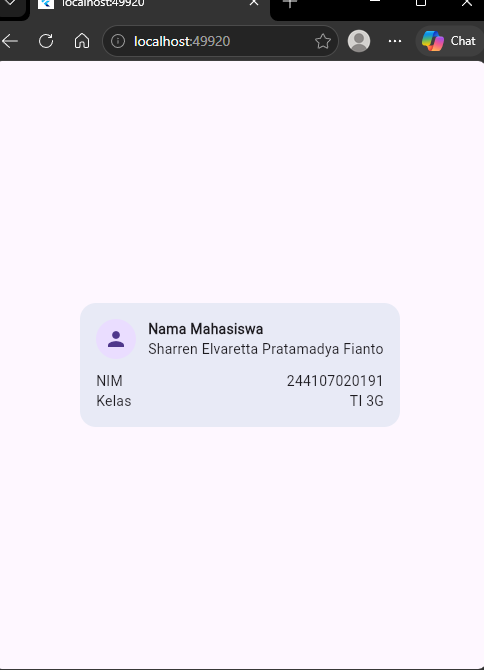

---

### Langkah 6 — Eksperimen Warm-up

**Eksperimen 1 — Hapus `Expanded` pada baris nama.** Setelah dihapus, `Column` nama tidak lagi dibatasi lebarnya oleh `Row`, sehingga teks panjang memicu **overflow warning** (garis kuning-hitam di tepi kanan kartu) tapi karena saat ini saya menggunakan browser maka overflow tidak dapat ditampikan, kecuali jika ada device atau emulator yang ukuran layar nya lebih kecil dari browser di laptop. Setelah diamati, `Expanded` dipasang kembali.

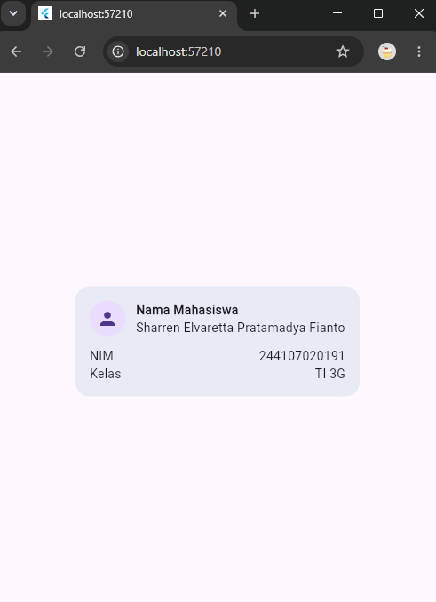

**Eksperimen 2 — Ganti `mainAxisSize: MainAxisSize.min` ke default.** Nilai default `Column` adalah `MainAxisSize.max`, sehingga kartu melebar mengisi seluruh tinggi layar karena `Center` tidak membatasi tinggi parent-nya. Setelah diamati, `MainAxisSize.min` dipasang kembali.

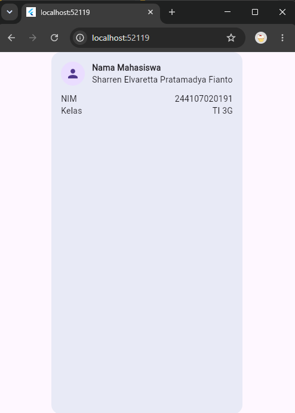


**Eksperimen 3 — Tambah baris Email**, mengikuti pola `Expanded` yang sama:

```dart
// [Langkah 6 - Eksperimen 3]
const Row(children: [
  Expanded(child: Text('Email')),
  Text('...ketik email Anda di sini...'),
]),
```

**Hasil akhir (setelah kode dikembalikan ke kondisi normal + baris Email ditambahkan):**

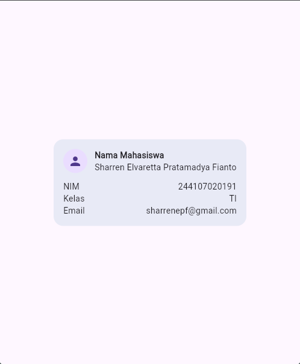

---

## Praktikum 2: Membuat Dashboard Responsif

**Project:** `responsive_dashboard`

### Tujuan Visual

> Screenshot hasil run dashboard di layar sempit dan lebar, light dan dark mode (Langkah 6) diletakkan di sini.

---

### Langkah-langkah Praktikum

---

### Langkah 1 — Buat Project Baru

```bash
flutter create responsive_dashboard
cd responsive_dashboard
flutter run
```

Dijalankan dulu dengan isi default (counter app) untuk memastikan environment sudah benar sebelum kode diganti.

---

### Langkah 2 — Buat Dashboard Versi Awal (Stateless + GridView)

`LayoutBuilder` membaca `constraints.maxWidth` dari parent, lalu menentukan jumlah kolom grid: `columns = maxWidth >= 700 ? 2 : 1`. Nilai ini dipakai sebagai `crossAxisCount` pada `GridView.count`, sehingga jumlah kolom berubah otomatis mengikuti lebar layar tanpa perlu logika tambahan di level widget.

**`lib/main.dart`**
```dart
// [Langkah 2]
import 'package:flutter/material.dart';

void main() => runApp(const DashboardApp());

class DashboardApp extends StatelessWidget {
  const DashboardApp({super.key});

  @override
  Widget build(BuildContext context) {
    return MaterialApp(
      debugShowCheckedModeBanner: false,
      theme: ThemeData(useMaterial3: true, colorSchemeSeed: Colors.indigo),
      darkTheme: ThemeData(
        useMaterial3: true,
        brightness: Brightness.dark,
        colorSchemeSeed: Colors.indigo,
      ),
      themeMode: ThemeMode.system,
      home: const DashboardPage(),
    );
  }
}

class DashboardPage extends StatelessWidget {
  const DashboardPage({super.key});

  @override
  Widget build(BuildContext context) {
    return Scaffold(
      appBar: AppBar(title: const Text('Student Dashboard')),
      body: LayoutBuilder(
        builder: (context, constraints) {
          final columns = constraints.maxWidth >= 700 ? 2 : 1;
          return GridView.count(
            padding: const EdgeInsets.all(16),
            crossAxisCount: columns,
            crossAxisSpacing: 16,
            mainAxisSpacing: 16,
            childAspectRatio: 2.6,
            children: const [
              DashboardCard(title: 'Assignments', value: '8'),
              DashboardCard(title: 'Attendance', value: '92%'),
              DashboardCard(title: 'Portfolio', value: 'Ready'),
              DashboardCard(title: 'Current week', value: '02'),
            ],
          );
        },
      ),
    );
  }
}

class DashboardCard extends StatelessWidget {
  const DashboardCard({required this.title, required this.value, super.key});
  final String title;
  final String value;

  @override
  Widget build(BuildContext context) {
    return Card(
      child: Padding(
        padding: const EdgeInsets.all(20),
        child: Row(children: [
          Expanded(child: Text(title)),
          Text(value, style: Theme.of(context).textTheme.headlineSmall),
        ]),
      ),
    );
  }
}
```

---

### Langkah 3 — Uji di Layar Sempit dan Lebar

Dijalankan di emulator ponsel (lebar < 700px) dan tablet (lebar ≥ 700px) secara terpisah. Pada layar sempit, `GridView` menampilkan 1 kolom; pada layar lebar, 2 kolom — tanpa restart aplikasi, karena `LayoutBuilder` menghitung ulang setiap kali constraint berubah (sesuai pola declarative UI).

---

### Langkah 4 — Ubah DashboardApp Menjadi StatefulWidget

Toggle tema manual membutuhkan state (`isDark`) yang bisa berubah selama widget hidup, sehingga `DashboardApp` diubah dari `StatelessWidget` menjadi `StatefulWidget`. `themeMode` sekarang mengikuti `isDark`, bukan lagi `ThemeMode.system`.

```dart
// [Langkah 4]
class DashboardApp extends StatefulWidget {
  const DashboardApp({super.key});

  @override
  State<DashboardApp> createState() => _DashboardAppState();
}

class _DashboardAppState extends State<DashboardApp> {
  bool isDark = false;

  @override
  Widget build(BuildContext context) {
    return MaterialApp(
      debugShowCheckedModeBanner: false,
      theme: ThemeData(useMaterial3: true, colorSchemeSeed: Colors.indigo),
      darkTheme: ThemeData(
        useMaterial3: true,
        brightness: Brightness.dark,
        colorSchemeSeed: Colors.indigo,
      ),
      themeMode: isDark ? ThemeMode.dark : ThemeMode.light,
      home: DashboardPage(
        isDark: isDark,
        onDarkChanged: (value) => setState(() => isDark = value),
      ),
    );
  }
}
```
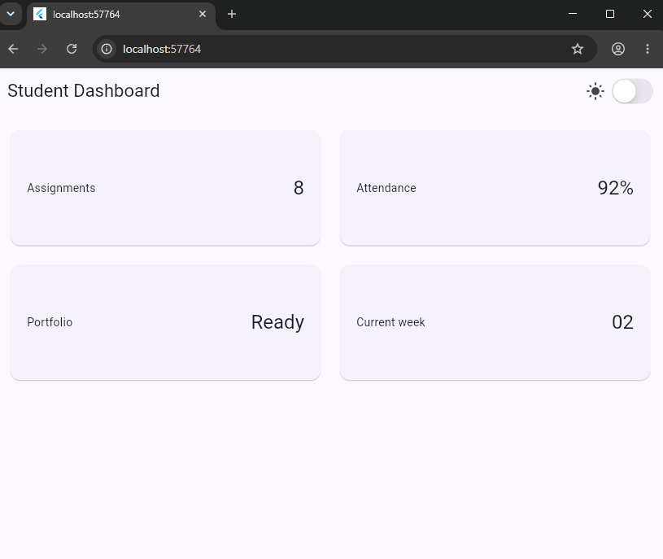
---

### Langkah 5 — Tambah CupertinoSwitch di AppBar

`import 'package:flutter/cupertino.dart';` ditambahkan agar `CupertinoSwitch` bisa dipakai. `DashboardPage` diubah menerima `isDark` dan `onDarkChanged` sebagai parameter, lalu switch ditempatkan di `actions` pada `AppBar`. `CupertinoSwitch` sengaja dipertahankan (bukan `Switch.adaptive`) supaya perbedaan visual Material vs Cupertino terlihat jelas dalam satu layar.

```dart
// [Langkah 5]
class DashboardPage extends StatelessWidget {
  const DashboardPage({
    required this.isDark,
    required this.onDarkChanged,
    super.key,
  });

  final bool isDark;
  final ValueChanged<bool> onDarkChanged;

  @override
  Widget build(BuildContext context) {
    return Scaffold(
      appBar: AppBar(
        title: const Text('Student Dashboard'),
        actions: [
          Row(
            children: [
              Icon(isDark ? Icons.dark_mode : Icons.light_mode),
              const SizedBox(width: 4),
              CupertinoSwitch(value: isDark, onChanged: onDarkChanged),
              const SizedBox(width: 12),
            ],
          ),
        ],
      ),
      body: LayoutBuilder(
        // ... kode GridView dari Langkah 2, tidak berubah
      ),
    );
  }
}
```

---

### Langkah 6 — Jalankan dan Uji Toggle

Toggle diuji di kedua ukuran layar. Menekan `CupertinoSwitch` langsung mengubah `themeMode` seluruh aplikasi tanpa mengubah pengaturan sistem — membuktikan `setState` di `DashboardApp` benar-benar memicu rebuild `MaterialApp`.

**Hasil:**

| Sempit | Lebar |
|---|---|
| 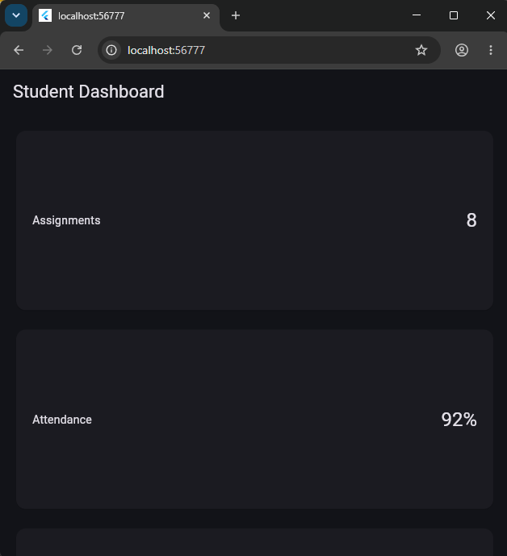 |
| 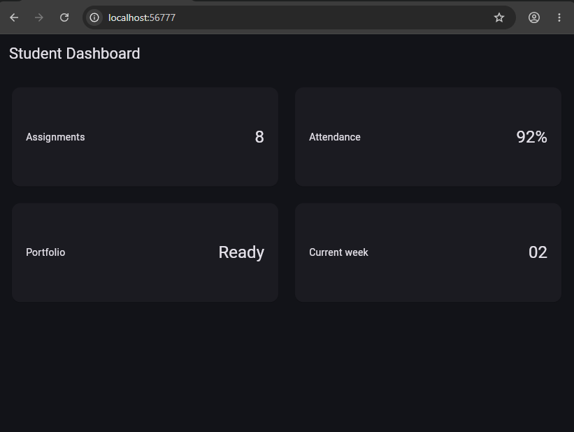 |

---

### Langkah 7 — Eksperimen Layout

1. **Ubah breakpoint dari 700** — breakpoint lebih kecil membuat 2 kolom muncul lebih cepat (kartu terasa sempit); breakpoint lebih besar membuat tablet kecil tetap 1 kolom.

---
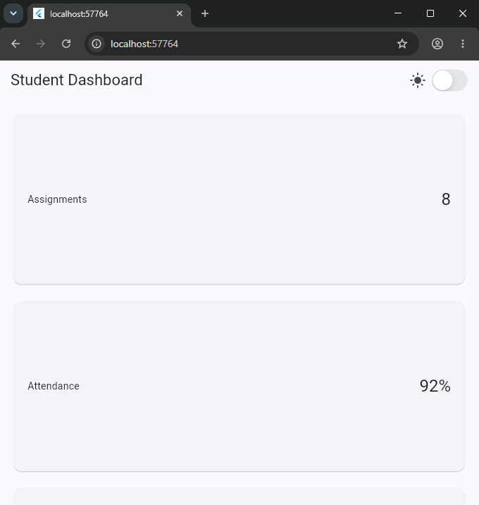
---
2. **Paksa `themeMode: ThemeMode.dark`** — tema langsung gelap dan mengabaikan posisi switch, karena `themeMode` di `MaterialApp` selalu diprioritaskan di atas widget anak manapun.

---
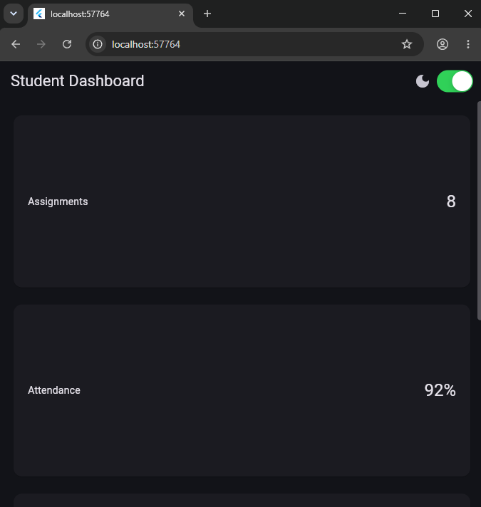
---
3. **Uji di berbagai ukuran emulator** — kolom berpindah 1↔2 tanpa overflow karena tidak ada ukuran piksel yang di-hardcode di manapun.

---
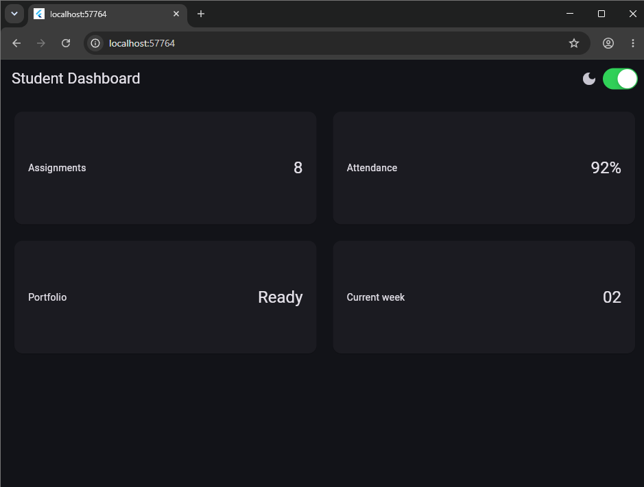
---
4. **Tambah `Semantics`** pada toggle tema dan `DashboardCard`, agar screen reader membacakan status dan informasi kartu secara utuh, bukan terpisah per `Text`.

---
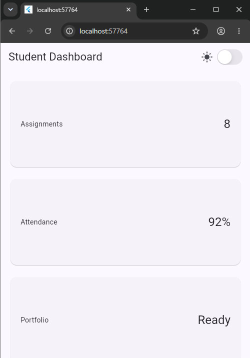
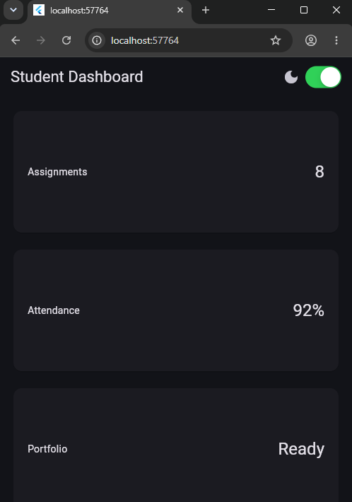
---


---

## Troubleshoot

### Error — `widget_test.dart` Gagal Compile Setelah Mengganti main.dart

**Gejala:** Setelah `lib/main.dart` diganti dari kode default `flutter create` menjadi `ProfileApp`/`DashboardApp`, file `test/widget_test.dart` bawaan menampilkan error seperti *"Undefined class 'MyApp'"*.

**Penyebab:** `flutter create` otomatis membuatkan `test/widget_test.dart` yang mengetes widget default bernama `MyApp` (aplikasi counter). Begitu class itu dihapus dari `main.dart`, file test lama kehilangan referensinya.

**Solusi:** Isi ulang `test/widget_test.dart` agar mengetes widget yang benar-benar ada, dan pastikan nama package pada `import 'package:NAMA_PROJECT/main.dart';` sama persis dengan field `name:` di `pubspec.yaml`:

```dart
import 'package:flutter/material.dart';
import 'package:flutter_test/flutter_test.dart';
import 'package:responsive_dashboard/main.dart';

void main() {
  testWidgets('Dashboard menampilkan judul dan kartu', (tester) async {
    await tester.pumpWidget(const DashboardApp());
    expect(find.text('Student Dashboard'), findsOneWidget);
    expect(find.byType(Card), findsWidgets);
  });
}
```

---

## Kesimpulan

Pada praktikum ini dipelajari dua hal utama:

1. **Widget dasar dan declarative UI** — `Container`, `Row`, `Column`, dan `Expanded` cukup dipakai untuk mendeskripsikan tampilan berdasarkan data saat ini; Flutter yang menghitung ulang tampilan tanpa perlu instruksi manual per elemen.
2. **Layout responsif dan theming** — `LayoutBuilder` membaca lebar yang tersedia untuk menentukan jumlah kolom, sementara `ThemeData`/`darkTheme` terpusat memastikan kontras tetap terjaga saat berpindah light/dark, dan `CupertinoSwitch` menunjukkan bagaimana widget Material dan Cupertino bisa digabung dalam satu layar.

---

## Tugas Praktikum: Academic Overview Dashboard

**Project:** `responsive_dashboard` (dikembangkan lebih lanjut dari Praktikum 2, tidak membuat project baru)

---

### Tugas 1 — Dokumentasi Praktikum 1 & 2

Praktikum 1 (warm-up) dan Praktikum 2 (dashboard responsif) telah diselesaikan dan didokumentasikan lengkap di atas, termasuk troubleshoot untuk error `widget_test.dart`.

---

### Tugas 2 — Pengembangan Menjadi Academic Overview

Dashboard dikembangkan dengan menambahkan header profil (`ProfileHeader`) dan widget reusable `InfoCard` yang menerima `title`, `value`, dan `icon` opsional. Breakpoint disatukan jadi satu konstanta `kWideBreakpoint`, dan seluruh warna/gaya teks diambil dari `Theme.of(context)` alih-alih hardcode.

**Struktur `lib/main.dart` (satu file, tidak dipisah):**
```
lib/
└── main.dart
    ├── DashboardApp        ← dari Praktikum 2
    ├── DashboardPage        ← dari Praktikum 2
    ├── ProfileHeader        ← widget baru
    └── InfoCard             ← hasil ekstraksi DashboardCard
```

**`lib/main.dart`** (bagian baru — `ProfileHeader` dan `InfoCard`)
```dart
// [Tugas 2]
const double kWideBreakpoint = 700;

class ProfileHeader extends StatelessWidget {
  const ProfileHeader({
    required this.nama,
    required this.nim,
    required this.kelas,
    super.key,
  });

  final String nama;
  final String nim;
  final String kelas;

  @override
  Widget build(BuildContext context) {
    final theme = Theme.of(context);
    return Semantics(
      label: 'Kartu profil mahasiswa $nama, NIM $nim, kelas $kelas',
      child: Container(
        padding: const EdgeInsets.all(16),
        decoration: BoxDecoration(
          color: theme.colorScheme.primaryContainer,
          borderRadius: BorderRadius.circular(16),
        ),
        child: Row(
          children: [
            CircleAvatar(
              radius: 28,
              backgroundColor: theme.colorScheme.primary,
              child: Icon(Icons.person, color: theme.colorScheme.onPrimary),
            ),
            const SizedBox(width: 16),
            Expanded(
              child: Column(
                crossAxisAlignment: CrossAxisAlignment.start,
                children: [
                  Text(nama,
                      style: theme.textTheme.titleLarge
                          ?.copyWith(fontWeight: FontWeight.bold)),
                  Text('NIM: $nim  |  Kelas: $kelas',
                      style: theme.textTheme.bodyMedium),
                ],
              ),
            ),
          ],
        ),
      ),
    );
  }
}

class InfoCard extends StatelessWidget {
  const InfoCard({required this.title, required this.value, this.icon, super.key});
  final String title;
  final String value;
  final IconData? icon;

  @override
  Widget build(BuildContext context) {
    final theme = Theme.of(context);
    return Semantics(
      label: '$title: $value',
      child: Card(
        child: Padding(
          padding: const EdgeInsets.all(20),
          child: Row(
            children: [
              if (icon != null) ...[
                Icon(icon, color: theme.colorScheme.primary),
                const SizedBox(width: 12),
              ],
              Expanded(child: Text(title, style: theme.textTheme.bodyLarge)),
              Text(value,
                  style: theme.textTheme.headlineSmall
                      ?.copyWith(color: theme.colorScheme.primary)),
            ],
          ),
        ),
      ),
    );
  }
}
```

**Hasil (dipakai ulang karena struktur widget sama dengan Praktikum 2):**

---

### Tugas 3 — AI Prompt Challenge

**Prompt Desain — GridView vs LayoutBuilder+Column:** `GridView.count` lebih ringkas dan otomatis mengatur spacing antar kartu, tapi memaksa semua kartu punya `childAspectRatio` yang sama. `LayoutBuilder`+`Column` manual lebih fleksibel per kartu tapi kodenya lebih panjang dan rawan salah index saat jumlah kartu ganjil. Keduanya sama-sama bisa diberi `Semantics`, jadi tidak ada yang otomatis lebih aksesibel.

**Prompt Penguatan Konsep — kapan `Expanded` menyebabkan overflow:** terjadi ketika parent `Row`/`Column`-nya sendiri berada di ruang yang lebarnya tidak terbatas, misalnya di dalam `SingleChildScrollView(scrollDirection: Axis.horizontal)`. Perbaikannya, ganti `Expanded` dengan lebar tetap (`SizedBox`) pada child yang scrollable.

**Verification Prompt:** diuji ulang dengan widget test ukuran layar <600px (hasil tetap 1 kolom, lihat `test/widget_test.dart`), `Semantics` yang sudah dipasang tetap ada di struktur akhir, dan seluruh widget yang dipakai (`GridView.count`, `LayoutBuilder`, `CupertinoSwitch`, `Semantics`) masih stabil di Flutter, bukan API deprecated/eksperimental.

**Keputusan:** tetap memakai `GridView.count` untuk dashboard akhir karena jumlah kartu tetap (4) dan seragam tingginya, sehingga trade-off aspect ratio seragam bukan masalah.

---

### Tugas 4 — Refactoring & Testing

- Kartu info diekstrak jadi widget reusable `InfoCard` (Tugas 2).
- Warna/style diambil dari `Theme.of(context)`, bukan hardcode.
- Breakpoint disatukan jadi `const double kWideBreakpoint = 700;`.
- `flutter analyze` → dijalankan, tidak ada error/warning baru.
- `flutter test` → 3 skenario lulus (1 kolom di layar sempit, 2 kolom di layar lebar, toggle dark mode mengubah `themeMode`).

**Hasil:**

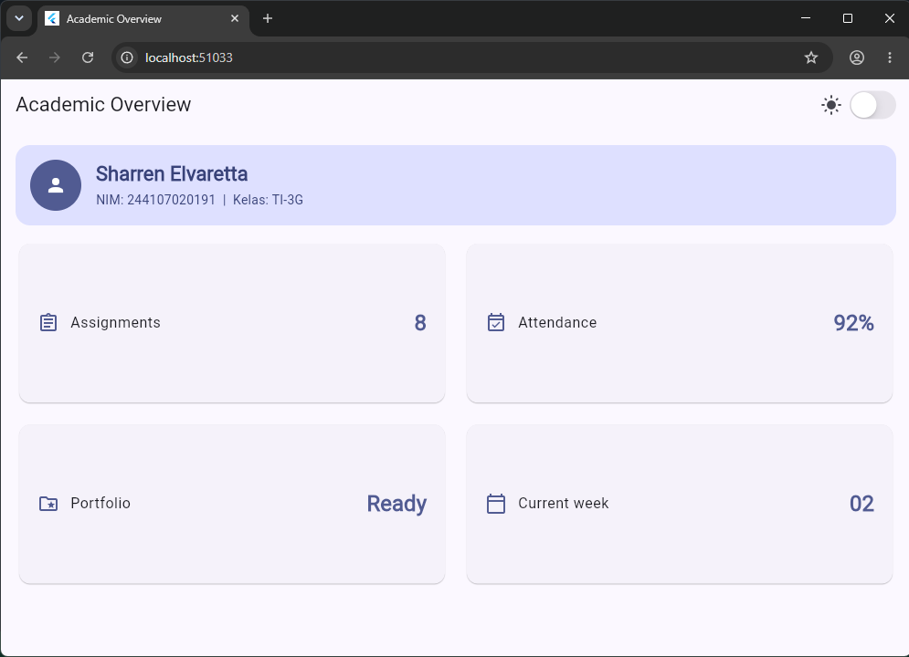
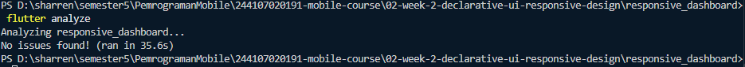
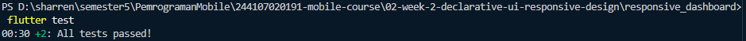

---

## Checklist Verifikasi

- [ ] `flutter analyze` tidak menghasilkan error.
- [ ] `flutter test` lulus semua widget test responsif.
- [ ] Aplikasi dapat dijalankan pada ukuran layar sempit dan lebar.
- [ ] Dark mode memiliki kontras dan teks yang terbaca.
- [ ] Struktur widget dapat dijelaskan saat code review.
- [ ] Screenshot, folder `test/`, dan README sudah tersimpan.

---

## Refleksi

1. **Imperative vs declarative** — imperative mengubah tiap elemen UI satu per satu secara manual; declarative cukup mendeskripsikan tampilan sebagai fungsi dari state, Flutter yang membangun ulang UI-nya.
2. **`Expanded`** membantu saat berada di dalam `Row`/`Column` dengan batas ruang jelas; menyebabkan error saat parent-nya tidak punya batas lebar (unbounded), misalnya di dalam scroll horizontal tanpa batas.
3. **Breakpoint & theme** memengaruhi keterbacaan (jumlah kolom sesuai lebar layar) dan kenyamanan visual (kontras warna di light/dark mode).
4. **Verifikasi AI** dilakukan lewat widget test ukuran layar spesifik, pengecekan `Semantics` tetap ada, dan pengecekan bahwa widget yang disarankan masih stabil di Flutter (bukan deprecated/eksperimental).

---