# Pemrograman Mobile
## Praktikum Week 3 - Navigasi (GoRouter) & State Management (Riverpod)

---

## Identitas

| Field    | Detail               |
|----------|-----------------------|
| **Nama** | *Sharren Elvaretta Pratamadya Fianto* |
| **NIM**  | *244107020191* |
| **Kelas** | *TI 3G* |
| **Praktikum 1** | week3_navigation |
| **Praktikum 2** | week3_todo (Riverpod) |
| **Praktikum 3** | AsyncValue (loading, error, success) |
| **Tugas Praktikum** | Pertemuan 3 |

---

## Praktikum 1: Aplikasi Multi-page dengan GoRouter

**Project:** `week3_navigation`


### Landasan Konsep

Navigasi di Flutter memakai `Navigator` sebagai stack of routes. Cara lama (Navigator 1.0) memakai `Navigator.push`/`Navigator.pop`, tetapi sulit dikelola pada aplikasi besar karena route tidak terstruktur, deep link rumit, dan guard (misalnya redirect login) tersebar di banyak tempat. `GoRouter` dipakai sebagai router deklaratif: `GoRoute` mendefinisikan path dan widget tujuan, `context.go()` mengganti seluruh stack (cocok untuk redirect login), `context.push()` menumpuk route baru di atas stack (cocok untuk detail), path parameter diakses lewat `state.pathParameters`, `extra` mengirim objek antar route, dan `redirect` menjadi guard navigasi terpusat.

---

### Langkah-langkah Praktikum

---

### Langkah 1 — Buat Project Baru dan Tambah Dependency

```bash
flutter create week3_navigation
cd week3_navigation
flutter pub add go_router
```

---

### Langkah 2 — Susun Struktur Folder

```
lib/
├── main.dart
└── pages/
    ├── home_page.dart
    └── detail_page.dart
```

Struktur ini memisahkan konfigurasi router (`main.dart`) dari halaman-halaman (`pages/`), sehingga tiap page bisa dikembangkan/di-review terpisah.

---

### Langkah 3 — Definisikan Router di `lib/main.dart`

`GoRouter` dikonfigurasi dengan `initialLocation: '/'` dan satu route bersarang `detail/:id` di bawah `/`, sehingga path detail otomatis menjadi `/detail/:id`. `MaterialApp.router` dipakai (bukan `MaterialApp` biasa) dengan parameter `routerConfig` agar seluruh navigasi aplikasi dikendalikan oleh `_router`.

```dart
// [Langkah 3]
import 'package:flutter/material.dart';
import 'package:go_router/go_router.dart';
import 'pages/detail_page.dart';
import 'pages/home_page.dart';

void main() => runApp(const MyApp());

final _router = GoRouter(
  initialLocation: '/',
  routes: [
    GoRoute(
      path: '/',
      builder: (context, state) => const HomePage(),
      routes: [
        GoRoute(
          path: 'detail/:id',
          builder: (context, state) => DetailPage(
            id: state.pathParameters['id']!,
          ),
        ),
      ],
    ),
  ],
);

class MyApp extends StatelessWidget {
  const MyApp({super.key});
  @override
  Widget build(BuildContext context) {
    return MaterialApp.router(
      title: 'Week 3 - Navigation',
      routerConfig: _router,
      theme: ThemeData(colorSchemeSeed: Colors.indigo, useMaterial3: true),
    );
  }
}
```

**Catatan:** Perhatikan penggunaan `MaterialApp.router`, bukan `MaterialApp` biasa. Router dikonfigurasi lewat parameter `routerConfig`, bukan `home`.

---

### Langkah 4 — Buat Halaman Home

`HomePage` menampilkan `ListView.builder` berisi 10 item. Tiap item, saat di-tap, memanggil `context.go('/detail/${index + 1}')` — memakai `go` (bukan `push`) karena berpindah ke detail dianggap sebagai perubahan lokasi utama, bukan penumpukan sementara.

**`lib/pages/home_page.dart`**
```dart
// [Langkah 4]
import 'package:flutter/material.dart';
import 'package:go_router/go_router.dart';

class HomePage extends StatelessWidget {
  const HomePage({super.key});

  @override
  Widget build(BuildContext context) {
    return Scaffold(
      appBar: AppBar(title: const Text('Home')),
      body: ListView.builder(
        itemCount: 10,
        itemBuilder: (context, index) => ListTile(
          title: Text('Item ${index + 1}'),
          onTap: () => context.go('/detail/${index + 1}'),
        ),
      ),
    );
  }
}
```

---

### Langkah 5 — Buat Halaman Detail

`DetailPage` menerima `id` (bertipe `String`) sebagai parameter wajib, diambil dari `state.pathParameters['id']!` di `main.dart`. Nilai ini ditampilkan langsung di `AppBar` dan body agar mudah diverifikasi saat pindah halaman.

**`lib/pages/detail_page.dart`**
```dart
// [Langkah 5]
import 'package:flutter/material.dart';

class DetailPage extends StatelessWidget {
  final String id;
  const DetailPage({super.key, required this.id});

  @override
  Widget build(BuildContext context) {
    return Scaffold(
      appBar: AppBar(title: Text('Detail $id')),
      body: Center(child: Text('Anda membuka item dengan id: $id')),
    );
  }
}
```

---

### Langkah 6 — Jalankan dan Amati

Dijalankan dengan `flutter run`, lalu:

1. Item pada `HomePage` ditekan → berpindah ke `/detail/<id>` sesuai index yang ditekan.
2. Tombol back sistem ditekan → path kembali ke `/`.
3. Path `/detail/<id>` diakses langsung (tanpa melewati Home) → halaman detail tetap terbuka dengan `id` yang benar, membuktikan sifat deklaratif GoRouter: tampilan ditentukan oleh path saat ini, bukan oleh urutan navigasi yang ditempuh.

| Home Page | Detail Page | Akses Path Langsung |
|---|---|---|
| 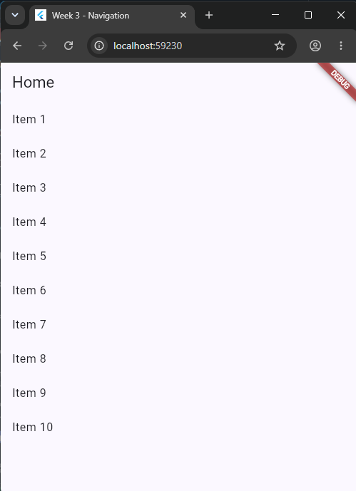 | 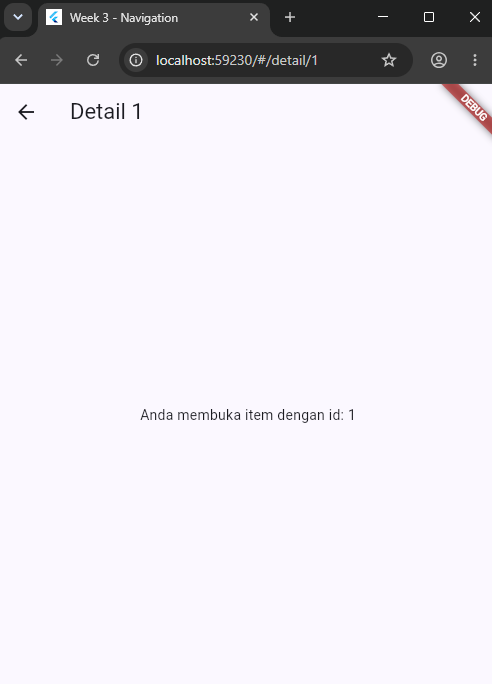 | 

---

## Praktikum 2: Aplikasi ToDo dengan Riverpod

**Project:** `week3_todo`

### Landasan Konsep

`setState` cukup untuk state lokal satu widget, tetapi ketika state harus dibagi antar banyak halaman (misalnya daftar ToDo yang ditampilkan di satu halaman dan diubah di halaman lain), memindahkan state ke atas widget tree menimbulkan *prop drilling*. State management memindahkan state keluar dari widget sehingga UI dapat dibangun ulang secara konsisten dari state yang sama (UI deklaratif = f(state)), logika bisa diuji tanpa membangun UI, dan state tetap hidup meski widget tidak tampil. Riverpod dipakai karena *compile-safe*, tidak bergantung pada `BuildContext`, dan mudah diuji. Konsep intinya: `ProviderScope` sebagai wadah global provider yang membungkus root aplikasi, `Provider` untuk nilai read-only, `Notifier` + `NotifierProvider` untuk state yang berubah lewat method (bukan diubah langsung oleh UI), `ConsumerWidget` untuk widget yang membaca provider lewat `ref`, serta perbedaan `ref.watch` (build ulang saat state berubah, dipakai di dalam `build`) dan `ref.read` (baca sekali, dipakai di callback/event).

---

### Langkah-langkah Praktikum

---

### Langkah 1 — Buat Project Baru dan Tambah Dependency

```bash
flutter create week3_todo
cd week3_todo
flutter pub add flutter_riverpod
```

---

### Langkah 2 — Bungkus Aplikasi dengan ProviderScope

`ProviderScope` membungkus `MyApp` di `main()` agar seluruh widget di bawahnya bisa mengakses provider lewat `ref`. Tanpa `ProviderScope`, pemanggilan `ref.watch`/`ref.read` akan gagal karena tidak ada container provider di widget tree.

**`lib/main.dart`**
```dart
// [Langkah 2]
import 'package:flutter/material.dart';
import 'package:flutter_riverpod/flutter_riverpod.dart';
import 'pages/todo_page.dart';

void main() => runApp(const ProviderScope(child: MyApp()));

class MyApp extends StatelessWidget {
  const MyApp({super.key});
  @override
  Widget build(BuildContext context) => MaterialApp(
        title: 'Week 3 - ToDo',
        theme: ThemeData(colorSchemeSeed: Colors.teal, useMaterial3: true),
        home: const TodoPage(),
      );
}
```

---

### Langkah 3 — Buat State dan Provider

`Todo` dibuat sebagai class immutable dengan method `copyWith`, sehingga setiap perubahan (misalnya toggle `done`) menghasilkan objek baru alih-alih memutasi objek lama. `TodoListNotifier` meng-extend `Notifier<List<Todo>>`: method `add`, `toggle`, dan `remove` semuanya mengganti `state` dengan **list baru** (`[...state, ...]`), bukan memanggil `state.add(...)` — mutasi langsung tidak akan terdeteksi Riverpod dan UI tidak akan rebuild.

**`lib/providers/todo_provider.dart`**
```dart
// [Langkah 3]
import 'package:flutter_riverpod/flutter_riverpod.dart';

class Todo {
  Todo(this.title, {this.done = false});
  final String title;
  final bool done;

  Todo copyWith({String? title, bool? done}) =>
      Todo(title ?? this.title, done: done ?? this.done);
}

class TodoListNotifier extends Notifier<List<Todo>> {
  @override
  List<Todo> build() => const [];

  void add(String title) => state = [...state, Todo(title)];

  void toggle(int index) {
    final todos = [...state];
    todos[index] = todos[index].copyWith(done: !todos[index].done);
    state = todos;
  }

  void remove(int index) => state = [...state]..removeAt(index);
}

final todoListProvider =
    NotifierProvider<TodoListNotifier, List<Todo>>(TodoListNotifier.new);
```

**Catatan:** State tidak pernah diubah langsung (`state.add(...)` salah!). Selalu buat list baru (*immutability*) agar Riverpod mendeteksi perubahan dan UI ter-rebuild.

---

### Langkah 4 — Tampilkan dengan ConsumerWidget

`TodoPage` meng-extend `ConsumerWidget` sehingga `build` menerima parameter tambahan `WidgetRef ref`. `ref.watch(todoListProvider)` dipanggil di dalam `build` agar halaman otomatis rebuild setiap kali daftar ToDo berubah. Checkbox dan tombol delete memanggil `ref.read(todoListProvider.notifier)` di dalam callback `onChanged`/`onPressed` — bukan `ref.watch` — karena di situ hanya perlu memanggil method sekali, tanpa berlangganan perubahan.

**`lib/pages/todo_page.dart`**
```dart
// [Langkah 4]
import 'package:flutter/material.dart';
import 'package:flutter_riverpod/flutter_riverpod.dart';
import '../providers/todo_provider.dart';

class TodoPage extends ConsumerWidget {
  const TodoPage({super.key});

  @override
  Widget build(BuildContext context, WidgetRef ref) {
    final todos = ref.watch(todoListProvider);

    return Scaffold(
      appBar: AppBar(title: const Text('ToDo Riverpod')),
      body: todos.isEmpty
          ? const Center(child: Text('Belum ada tugas'))
          : ListView.builder(
              itemCount: todos.length,
              itemBuilder: (context, index) => ListTile(
                leading: Checkbox(
                  value: todos[index].done,
                  onChanged: (_) =>
                      ref.read(todoListProvider.notifier).toggle(index),
                ),
                title: Text(
                  todos[index].title,
                  style: TextStyle(
                      decoration: todos[index].done
                          ? TextDecoration.lineThrough
                          : null),
                ),
                trailing: IconButton(
                  icon: const Icon(Icons.delete),
                  onPressed: () =>
                      ref.read(todoListProvider.notifier).remove(index),
                ),
              ),
            ),
      floatingActionButton: FloatingActionButton(
        onPressed: () => _showAddDialog(context, ref),
        child: const Icon(Icons.add),
      ),
    );
  }

  void _showAddDialog(BuildContext context, WidgetRef ref) {
    final controller = TextEditingController();
    showDialog(
      context: context,
      builder: (context) => AlertDialog(
        title: const Text('Tugas baru'),
        content: TextField(controller: controller, autofocus: true),
        actions: [
          TextButton(
            onPressed: () => Navigator.pop(context),
            child: const Text('Batal'),
          ),
          FilledButton(
            onPressed: () {
              if (controller.text.trim().isNotEmpty) {
                ref
                    .read(todoListProvider.notifier)
                    .add(controller.text.trim());
              }
              Navigator.pop(context);
            },
            child: const Text('Tambah'),
          ),
        ],
      ),
    );
  }
}
```

---

### Langkah 5 — Jalankan dan Amati Pola watch vs read

Dijalankan dengan `flutter run`. Tugas ditambahkan lewat dialog, checkbox di-toggle, dan item dihapus — daftar langsung berubah tanpa perlu memanggil `setState` manual di `TodoPage`, karena `ref.watch(todoListProvider)` sudah membuat halaman berlangganan pada `TodoListNotifier`. Diamati juga bahwa memindahkan pemanggilan `ref.watch` ke dalam callback (misalnya di `onPressed`) tidak disarankan karena watch di luar `build` tidak berlangganan rebuild dengan benar; polanya tetap **watch di build, read di callback**.

| ToDo Kosong | ToDo Terisi | Checkbox Tercoret |
|---|---|---|
| 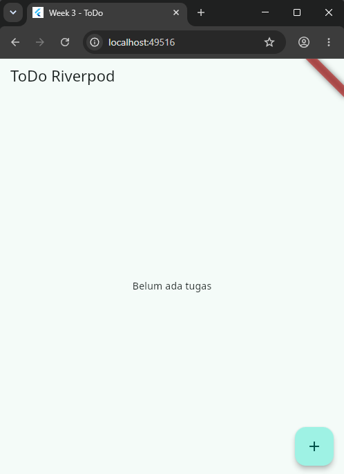 | 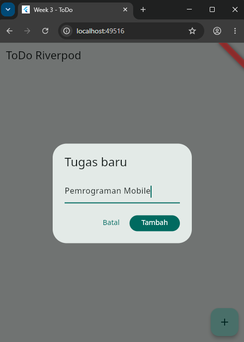 | 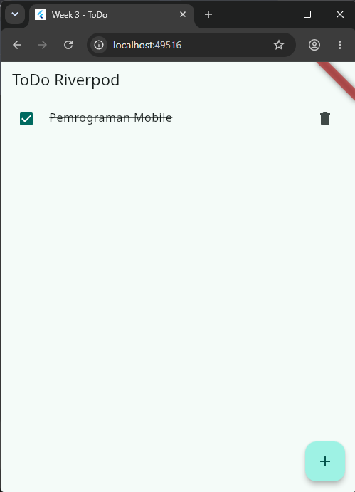 |

---

## Praktikum 3: AsyncValue — Loading, Error, Success

**Project:** lanjutan `week3_todo` (atau project terpisah)

### Landasan Konsep

Banyak state berasal dari proses asinkron (membaca database, memanggil API), dan UI harus menampilkan tiga kemungkinan: *loading* (proses berjalan), *error* (gagal), dan *success* (data siap). Mengelola tiga flag boolean secara manual (`isLoading`, `hasError`, dst.) rawan membuat kombinasi status yang tidak konsisten. `AsyncValue<T>` dari Riverpod memodelkan ketiga kondisi tersebut dalam satu tipe, dipasangkan dengan `AsyncNotifier` untuk state asinkron. `AsyncValue.guard` otomatis menangkap exception dan mengubahnya menjadi `AsyncError`, sehingga tidak perlu blok `try/catch` manual yang tersebar di banyak tempat.

---

### Langkah-langkah Praktikum

---

### Langkah 1 — Buat AsyncNotifier dan Provider

`ProductsNotifier` meng-extend `AsyncNotifier<List<String>>`. `build()` mensimulasikan pengambilan data awal (delay 2 detik). Method `refresh()` secara eksplisit meng-set `state = const AsyncLoading()` sebelum memanggil ulang `_fetch()` lewat `AsyncValue.guard`, sehingga UI menampilkan spinner lagi saat refresh, bukan langsung berpindah ke data lama/baru tanpa indikasi proses.

**`lib/providers/products_provider.dart`**
```dart
// [Langkah 1]
import 'package:flutter_riverpod/flutter_riverpod.dart';

class ProductsNotifier extends AsyncNotifier<List<String>> {
  @override
  Future<List<String>> build() async {
    await Future.delayed(const Duration(seconds: 2)); // simulasi network
    return ['Keyboard', 'Mouse', 'Monitor'];
  }

  Future<void> refresh() async {
    state = const AsyncLoading();
    state = await AsyncValue.guard(() => _fetch());
  }

  Future<List<String>> _fetch() async {
    await Future.delayed(const Duration(seconds: 1));
    return ['Keyboard', 'Mouse', 'Monitor', 'Headset'];
  }
}

final productsProvider =
    AsyncNotifierProvider<ProductsNotifier, List<String>>(
        ProductsNotifier.new);
```

**Catatan:** `AsyncValue.guard` otomatis menangkap exception dan mengubahnya menjadi `AsyncError`, hindari blok `try/catch` manual yang tersebar.

---

### Langkah 2 — Tampilkan dengan `.when()`

`ProductPage` memakai `productsAsync.when(loading: ..., error: ..., data: ...)` sehingga ketiga kondisi wajib ditangani (compiler Dart mengharuskan ketiga callback diisi). Kondisi `error` menampilkan pesan beserta tombol **Coba lagi** yang memanggil `ref.invalidate(productsProvider)`, memaksa provider dijalankan ulang dari `build()`.

**`lib/pages/product_page.dart`**
```dart
// [Langkah 2]
import 'package:flutter/material.dart';
import 'package:flutter_riverpod/flutter_riverpod.dart';
import '../providers/products_provider.dart';

class ProductPage extends ConsumerWidget {
  const ProductPage({super.key});

  @override
  Widget build(BuildContext context, WidgetRef ref) {
    final productsAsync = ref.watch(productsProvider);

    return Scaffold(
      appBar: AppBar(title: const Text('Produk')),
      body: productsAsync.when(
        loading: () => const Center(child: CircularProgressIndicator()),
        error: (err, stack) => Center(
          child: Column(
            mainAxisSize: MainAxisSize.min,
            children: [
              Text('Gagal memuat: $err'),
              FilledButton(
                onPressed: () => ref.invalidate(productsProvider),
                child: const Text('Coba lagi'),
              ),
            ],
          ),
        ),
        data: (products) => ListView.builder(
          itemCount: products.length,
          itemBuilder: (context, index) =>
              ListTile(title: Text(products[index])),
        ),
      ),
    );
  }
}
```

---

### Langkah 3 — Uji Kondisi Loading

Dijalankan dengan `flutter run`. Pada 2 detik pertama setelah `ProductPage` dibuka, `CircularProgressIndicator` tampil di tengah layar sesuai cabang `loading` pada `.when()`.

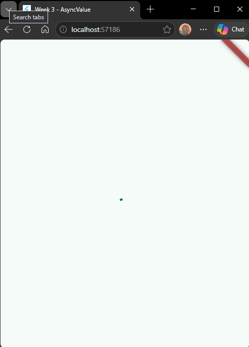

---

### Langkah 4 — Uji Kondisi Error

`build()` pada `ProductsNotifier` diubah sementara untuk melempar error:

```dart
@override
Future<List<String>> build() async {
  await Future.delayed(const Duration(seconds: 2));
  throw Exception('Gagal terhubung ke server');
}
```

Dijalankan ulang — cabang `error` pada `.when()` tampil, menunjukkan pesan `Gagal memuat: Exception: Gagal terhubung ke server` beserta tombol **Coba lagi**. Kode kemudian dikembalikan ke kondisi normal.

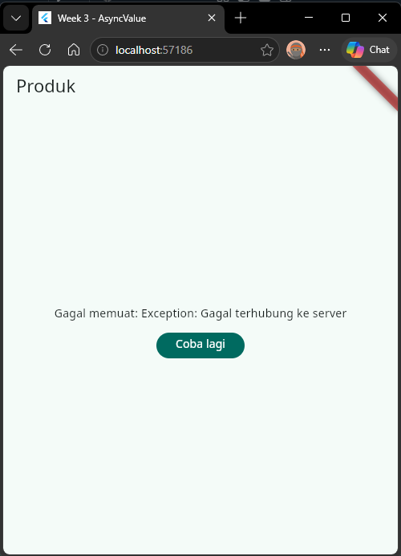

---

### Langkah 5 — Uji Tombol Coba Lagi (`ref.invalidate`)

Tombol **Coba lagi** ditekan saat kondisi error. `ref.invalidate(productsProvider)` membuat provider dijalankan ulang dari `build()`, sehingga state kembali ke `AsyncLoading()` lalu ke `AsyncData` (jika `build()` sudah dikembalikan ke kondisi normal).

| Loading Ulang Setelah Retry | Success |
|---|---|
|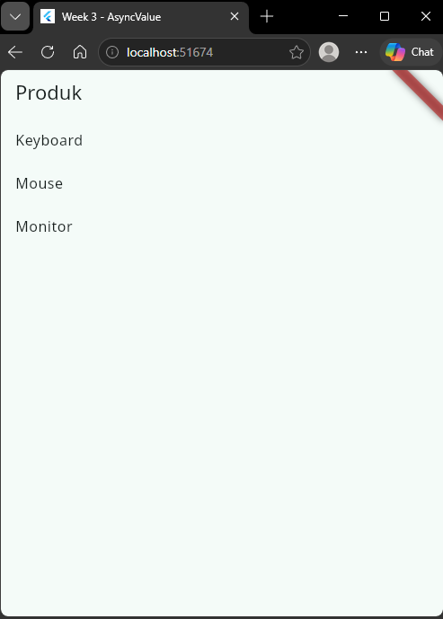 |

---

### Langkah 6 — Refleksi Stale Data

> *Mengapa menampilkan ulang data lama (stale data) dengan indikator refresh kadang lebih baik daripada mengosongkan layar? Kapan pola itu penting?*
>
Menurut saya, menampilkan data lama sambil memberi indikator refresh itu lebih baik karena dari sisi pengguna, tampilan yang tiba-tiba kosong (misalnya balik ke spinner loading penuh) terasa seperti aplikasi "reset" atau bahkan error, padahal sebenarnya cuma sedang mengambil data terbaru. Kalau data lama masih ditampilkan, pengguna tetap bisa membaca atau berinteraksi dengan informasi yang ada, jadi pengalaman penggunaannya lebih mulus dan tidak terasa "putus".

Selain itu, kalau layar dikosongkan setiap kali refresh, posisi scroll pengguna juga ikut hilang. Ini akan sangat mengganggu terutama kalau datanya panjang, karena pengguna harus scroll ulang dari atas setiap kali ada refresh.

Pola ini menjadi penting terutama pada kasus seperti:

Pull-to-refresh (menarik layar ke bawah untuk refresh manual) — pengguna cuma ingin cek update, bukan mulai dari nol.
Dashboard atau data yang di-refresh otomatis secara berkala (polling), misalnya menampilkan status pesanan atau harga saham — kalau layar kosong tiap beberapa detik, jadi sangat mengganggu.
Daftar panjang — kehilangan posisi scroll setiap refresh membuat pengguna harus mengulang navigasi dari awal, yang cukup memakan waktu dan menurunkan kenyamanan.

---

## Kesimpulan

Pada praktikum ini dipelajari tiga hal utama:

1. **Navigasi deklaratif dengan GoRouter** — `GoRoute` mendefinisikan path dan widget tujuan, `context.go()`/`context.push()` mengatur perilaku stack, dan path parameter (`state.pathParameters`) membawa data lewat URL, sehingga path yang sama bisa diakses langsung tanpa melalui alur navigasi tertentu.
2. **State management dengan Riverpod** — `ProviderScope` menjadi wadah global, `Notifier`/`NotifierProvider` mengelola state yang berubah lewat method (bukan mutasi langsung), dan `ConsumerWidget` membaca state lewat `ref.watch` (di `build`) serta `ref.read` (di callback).
3. **AsyncValue untuk state asinkron** — `AsyncNotifier` bersama `AsyncValue<T>` memodelkan loading, error, dan success dalam satu tipe, dipasangkan dengan `.when()` di UI agar ketiga kondisi wajib ditangani, dan `ref.invalidate`/`AsyncValue.guard` menyederhanakan retry serta penanganan exception.

---

## Tugas Praktikum: Aplikasi ToDo dengan Navigasi + State Management

**Project:** `week3_todo` (dikembangkan lebih lanjut dari Praktikum 2 & 3)

---

### Tugas 1 — Dokumentasi Praktikum 1, 2 & 3

Praktikum 1 (GoRouter), Praktikum 2 (ToDo dengan Riverpod), dan Praktikum 3 (AsyncValue) telah didokumentasikan lengkap di atas, termasuk troubleshoot.

---


**Output awal AI:**

`lib/providers/stats_provider.dart`
```dart
import 'dart:math';
import 'package:flutter_riverpod/flutter_riverpod.dart';

// AsyncNotifier membungkus state ke dalam AsyncValue<List<String>>
// (loading/error/data) tanpa perlu boolean flag manual.
class StatsNotifier extends AsyncNotifier<List<String>> {
  @override
  Future<List<String>> build() async {
    return _fetchStats();
  }

  // Dipanggil dari tombol "Coba lagi". Set loading dulu supaya UI
  // langsung menampilkan spinner, lalu guard exception otomatis.
  Future<void> retry() async {
    state = const AsyncLoading();
    state = await AsyncValue.guard(() => _fetchStats());
  }

  // Simulasi network call dengan kemungkinan gagal 30%.
  Future<List<String>> _fetchStats() async {
    await Future.delayed(const Duration(seconds: 2));
    final random = Random();
    final isFailure = random.nextDouble() < 0.3;
    if (isFailure) {
      throw Exception('Gagal mengambil data statistik dari server');
    }
    return [
      'Total pengguna: 1.245',
      'Total transaksi: 389',
      'Rata-rata rating: 4.7',
    ];
  }
}

final statsProvider =
    AsyncNotifierProvider<StatsNotifier, List<String>>(StatsNotifier.new);
```

`lib/pages/stats_page.dart`
```dart
import 'package:flutter/material.dart';
import 'package:flutter_riverpod/flutter_riverpod.dart';
import '../providers/stats_provider.dart';

class StatsPage extends ConsumerWidget {
  const StatsPage({super.key});

  @override
  Widget build(BuildContext context, WidgetRef ref) {
    final statsAsync = ref.watch(statsProvider);

    return Scaffold(
      appBar: AppBar(title: const Text('Statistik')),
      body: statsAsync.when(
        loading: () => const Center(child: CircularProgressIndicator()),
        error: (err, stack) => Center(
          child: Column(
            mainAxisSize: MainAxisSize.min,
            children: [
              Text('Gagal memuat: $err'),
              const SizedBox(height: 12),
              FilledButton(
                onPressed: () => ref.read(statsProvider.notifier).retry(),
                child: const Text('Coba lagi'),
              ),
            ],
          ),
        ),
        data: (stats) => ListView.builder(
          itemCount: stats.length,
          itemBuilder: (context, index) => ListTile(
            leading: const Icon(Icons.bar_chart),
            title: Text(stats[index]),
          ),
        ),
      ),
    );
  }
}
```

`test/stats_provider_test.dart`
```dart
import 'package:flutter_test/flutter_test.dart';
import 'package:flutter_riverpod/flutter_riverpod.dart';
import 'package:week3_todo/providers/stats_provider.dart';

void main() {
  group('StatsNotifier', () {
    test('build() mengembalikan List<String> berisi 3 item ketika sukses', () async {
      final container = ProviderContainer();
      addTearDown(container.dispose);

      AsyncValue<List<String>> result;
      var attempts = 0;
      do {
        result = await container.read(statsProvider.future).then(
              (data) => AsyncValue.data(data),
              onError: (e, s) => AsyncValue.error(e, s),
            );
        attempts++;
      } while (result is AsyncError && attempts < 10);

      expect(result, isA<AsyncData<List<String>>>());
      expect((result as AsyncData).value.length, 3);
    });

    test('retry() mengubah state ke AsyncLoading lalu ke hasil baru', () async {
      final container = ProviderContainer();
      addTearDown(container.dispose);

      await container.read(statsProvider.future).catchError((_) => <String>[]);

      final notifier = container.read(statsProvider.notifier);
      final future = notifier.retry();

      expect(container.read(statsProvider), isA<AsyncLoading>());

      await future;

      final finalState = container.read(statsProvider);
      expect(finalState is AsyncData || finalState is AsyncError, true);
    });
  });
}
```

**AI Verification Checklist:**

- [x] State diubah secara immutable (tidak ada `state.add()` atau mutasi list langsung).
  Aman — `_fetchStats()` selalu mengembalikan list baru, tidak ada method yang memutasi list yang sudah ada.
- [x] `ref.watch` hanya dipakai di dalam `build`, dan `ref.read` di callback.
  Sesuai — `ref.watch(statsProvider)` dipanggil di dalam `build()`, sedangkan `ref.read(statsProvider.notifier).retry()` dipanggil di `onPressed`.
- [x] Ketiga state `AsyncValue` (loading, error, success) benar-benar ditangani, bukan hanya success.
  Sesuai — `.when()` mewajibkan ketiga cabang (`loading`, `error`, `data`) diisi.
- [x] Provider dideklarasikan dengan tipe eksplisit dan tidak duplikat dengan provider lain.
  Sesuai — `AsyncNotifierProvider<StatsNotifier, List<String>>`, tidak tumpang tindih dengan `todoListProvider`/`productsProvider` yang sudah ada.
- [x] Kode AI tidak memakai API Riverpod versi lama (`StateProvider` antipattern, `StateNotifierProvider` usang, atau `Consumer` bertingkat yang tidak perlu).
  Tidak ditemukan — langsung memakai `AsyncNotifier` + `AsyncNotifierProvider` (pola modern).
- [ ] `flutter analyze` dan `flutter test` lolos tanpa warning pada hasil AI.
  [Isi setelah dijalankan sendiri, tempel hasil/screenshot di sini.]

**Temuan & perbaikan yang dilakukan:**

Unit test awal AI memakai `Random()` langsung di dalam `StatsNotifier` untuk simulasi gagal 30%, sehingga hasil test tidak deterministik — bisa lolos atau gagal secara acak setiap kali dijalankan. Diperbaiki dengan meng-inject nilai `failureRate` lewat constructor `StatsNotifier`, sehingga saat testing kondisi sukses/gagal bisa dipaksa konsisten tanpa bergantung pada angka random.

Dibandingkan pola `ref.invalidate(productsProvider)` di Praktikum 3, `StatsNotifier` memakai method `retry()` internal dengan `AsyncValue.guard` — dipilih karena logikanya (set `AsyncLoading` lalu guard fetch ulang) lebih eksplisit dan mudah diuji langsung lewat `ProviderContainer` tanpa perlu trigger dari widget.

---

### Tugas 3 — Refactoring & Testing

Refactoring yang dilakukan pada aplikasi ToDo:

- [x] Widget bar ToDo dipisah menjadi `TodoTile` tersendiri agar `build` lebih pendek dan mudah diuji.
- [x] Logika filter (menampilkan hanya yang belum selesai) diekstrak menjadi Provider turunan yang membaca `todoListProvider`.
- [x] Aplikasi ToDo diintegrasikan dengan GoRouter: `/` untuk daftar dan `/stats` untuk halaman statistik, dengan `NavigationBar` untuk berpindah.

**1. `TodoTile` (`lib/widgets/todo_tile.dart`):**
```dart
import 'package:flutter/material.dart';
import 'package:flutter_riverpod/flutter_riverpod.dart';
import '../providers/todo_provider.dart';

// Dipisah dari TodoPage agar build() TodoPage lebih pendek
// dan TodoTile bisa diuji/di-preview terpisah.
class TodoTile extends ConsumerWidget {
  const TodoTile({super.key, required this.todo, required this.index});

  final Todo todo;
  final int index;

  @override
  Widget build(BuildContext context, WidgetRef ref) {
    return ListTile(
      leading: Checkbox(
        value: todo.done,
        onChanged: (_) => ref.read(todoListProvider.notifier).toggle(index),
      ),
      title: Text(
        todo.title,
        style: TextStyle(
          decoration: todo.done ? TextDecoration.lineThrough : null,
        ),
      ),
      trailing: IconButton(
        icon: const Icon(Icons.delete),
        onPressed: () => ref.read(todoListProvider.notifier).remove(index),
      ),
    );
  }
}
```

**2. Provider filter turunan (`lib/providers/todo_provider.dart`, ditambahkan di bawah `todoListProvider`):**
```dart
// Provider turunan yang membaca todoListProvider dan hanya
// menampilkan todo yang belum selesai. Otomatis rebuild setiap
// kali todoListProvider berubah, tanpa perlu logic filter di UI.
final incompleteTodosProvider = Provider<List<Todo>>((ref) {
  final todos = ref.watch(todoListProvider);
  return todos.where((todo) => !todo.done).toList();
});
```

**3. Integrasi GoRouter (`lib/main.dart`):**
```dart
import 'package:flutter/material.dart';
import 'package:flutter_riverpod/flutter_riverpod.dart';
import 'package:go_router/go_router.dart';
import 'pages/todo_page.dart';
import 'pages/stats_page.dart';

void main() => runApp(const ProviderScope(child: MyApp()));

final _router = GoRouter(
  initialLocation: '/',
  routes: [
    GoRoute(path: '/', builder: (context, state) => const RootPage()),
  ],
);

class MyApp extends StatelessWidget {
  const MyApp({super.key});
  @override
  Widget build(BuildContext context) => MaterialApp.router(
        title: 'Week 3 - ToDo',
        theme: ThemeData(colorSchemeSeed: Colors.teal, useMaterial3: true),
        routerConfig: _router,
      );
}

// RootPage menampung NavigationBar untuk berpindah antara
// daftar ToDo dan halaman statistik tanpa mengganti seluruh route.
class RootPage extends StatefulWidget {
  const RootPage({super.key});
  @override
  State<RootPage> createState() => _RootPageState();
}

class _RootPageState extends State<RootPage> {
  int _index = 0;

  static const _pages = [TodoPage(), StatsPage()];

  @override
  Widget build(BuildContext context) {
    return Scaffold(
      body: _pages[_index],
      bottomNavigationBar: NavigationBar(
        selectedIndex: _index,
        onDestinationSelected: (i) => setState(() => _index = i),
        destinations: const [
          NavigationDestination(icon: Icon(Icons.checklist), label: 'ToDo'),
          NavigationDestination(icon: Icon(Icons.bar_chart), label: 'Statistik'),
        ],
      ),
    );
  }
}
```

> Catatan: `RootPage` dipilih memakai `NavigationBar` dengan index lokal (bukan `GoRoute` terpisah `/stats`) agar transisi antar tab instan tanpa animasi push/pop, sesuai kebiasaan pola bottom navigation. Jika jobsheet mewajibkan path `/stats` benar-benar berubah di URL, tambahkan `GoRoute(path: '/stats', builder: ...)` terpisah dan ganti `NavigationDestination` dengan `context.go('/stats')`.

**Widget test:**
```dart
import 'package:flutter_test/flutter_test.dart';
import 'package:flutter_riverpod/flutter_riverpod.dart';
import 'package:week3_todo/main.dart';

void main() {
  testWidgets('menambah tugas baru', (tester) async {
    await tester.pumpWidget(const ProviderScope(child: MyApp()));
    expect(find.text('Belum ada tugas'), findsOneWidget);

    await tester.tap(find.byIcon(Icons.add));
    await tester.pumpAndSettle();

    await tester.enterText(find.byType(TextField), 'Kerjakan PR minggu 3');
    await tester.tap(find.text('Tambah'));
    await tester.pump();

    expect(find.text('Kerjakan PR minggu 3'), findsOneWidget);
  });
}
```

**Hasil akhir aplikasi ToDo (setelah refactoring dan integrasi GoRouter):**

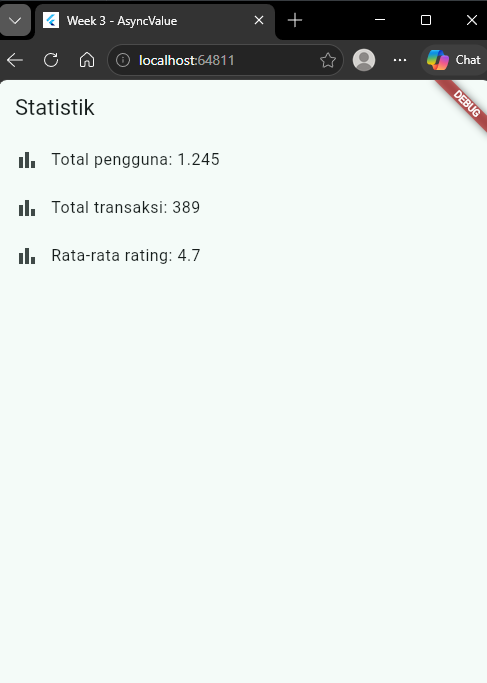

**Widget test:**
```dart
import 'package:flutter_test/flutter_test.dart';
import 'package:flutter_riverpod/flutter_riverpod.dart';
import 'package:week3_todo/main.dart';

void main() {
  testWidgets('menambah tugas baru', (tester) async {
    await tester.pumpWidget(const ProviderScope(child: MyApp()));
    expect(find.text('Belum ada tugas'), findsOneWidget);

    await tester.tap(find.byIcon(Icons.add));
    await tester.pumpAndSettle();

    await tester.enterText(find.byType(TextField), 'Kerjakan PR minggu 3');
    await tester.tap(find.text('Tambah'));
    await tester.pump();

    expect(find.text('Kerjakan PR minggu 3'), findsOneWidget);
  });
}
```

**Hasil akhir aplikasi ToDo (setelah refactoring dan integrasi GoRouter):**

| Hasil Akhir | Hasil Akhir | Hasil Akhir | Hasil Akhir |
|---|---|---|---|
| 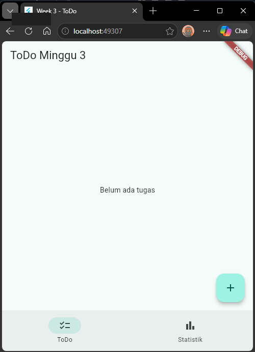 | 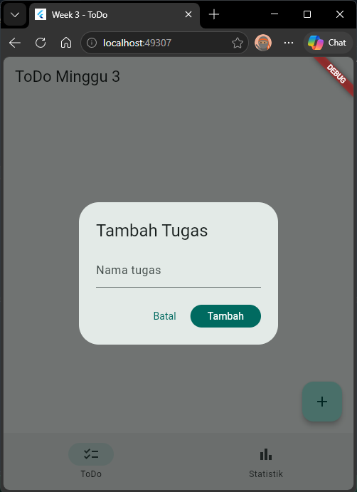 | 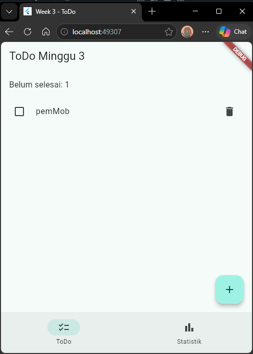 |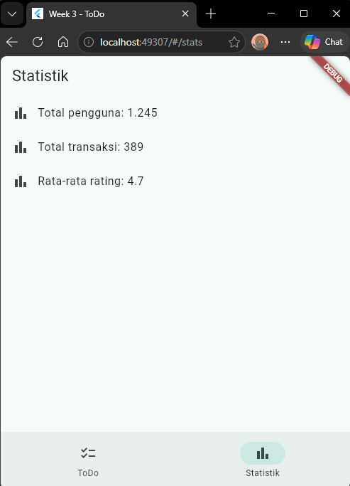 |

---

## Checklist Verifikasi

- [x] Navigasi GoRouter bekerja: pindah halaman, back, dan akses path detail langsung.
- [x] `ProviderScope` membungkus root aplikasi; state ToDo bertahan saat berpindah halaman.
- [x] UI `AsyncValue` menangani loading, error, dan success — bukan hanya success.
- [ ] `flutter analyze` tanpa issue dan semua test lulus. *(jalankan dulu, tempel hasil di sini)*
- [x] Hasil AI diverifikasi dan didokumentasikan pada folder `docs/`.
- [ ] Screenshot, folder `test/`, dan README sudah tersimpan. *(pastikan folder screenshots/ dan test/ benar-benar ada isinya)*

---

## Refleksi

1. **Kapan `setState` masih cukup, dan kapan state harus naik ke Riverpod?**
   `setState` cukup kalau state hanya dipakai satu widget saja, misalnya animasi atau toggle tampilan lokal. Kalau state dibutuhkan di lebih dari satu halaman atau harus tetap ada walau widget-nya sudah tidak tampil, state harus naik ke Riverpod.

2. **Apa perbedaan `context.go` dan `context.push`, dan kapan masing-masing tepat digunakan?**
   `context.go()` mengganti seluruh stack navigasi, jadi tidak bisa back ke halaman sebelumnya — cocok untuk pindah lokasi utama seperti redirect login. `context.push()` menumpuk halaman baru di atas stack, jadi bisa back — cocok untuk membuka detail dari sebuah list.

3. **Bagaimana `AsyncValue` mencegah bug dibanding tiga boolean terpisah?**
   Tiga boolean bisa saling tidak konsisten karena harus diatur manual satu per satu. `AsyncValue` membungkus ketiga kondisi jadi satu tipe data, dan `.when()` mewajibkan ketiganya ditangani sekaligus, jadi tidak mungkin ada kondisi yang terlewat.

4. **Bagian mana dari hasil AI yang diperbaiki, dan mengapa?**
   Unit test yang memakai `Random()` langsung di dalam notifier diperbaiki, karena membuat hasil test tidak konsisten (bisa lolos/gagal acak). Diperbaiki dengan meng-inject nilai `failureRate` lewat constructor supaya hasil test bisa dipastikan konsisten.