# Pemrograman Mobile
## Praktikum Week 4 - Networking & REST API (Dio + Riverpod)

---

## Identitas

| Field    | Detail               |
|----------|-----------------------|
| **Nama** | *Sharren Elvaretta Pratamadya Fianto* |
| **NIM**  | *244107020191* |
| **Kelas** | *TI 3G* |
| **Praktikum 1** | week4_api (Dio & Model Data) |
| **Praktikum 2** | week4_api (Provider & Error Handling) |
| **Praktikum 3** | week4_api (Pagination) |
| **Tugas Praktikum** | Pertemuan 4 |

---

## Praktikum 1: Dio dan Model Data

**Project:** `week4_api`

### Landasan Konsep

Komunikasi aplikasi mobile dengan server umumnya memakai HTTP: client mengirim *request* (method + URL + header + body), server membalas dengan *status code* + body, dan data yang dipertukarkan berformat JSON. REST API memetakan operasi ke resource lewat method HTTP (`GET` untuk membaca, `POST` untuk membuat, `PUT/PATCH` untuk mengubah, `DELETE` untuk menghapus), dan status code menentukan tiga kelompok hasil yang wajib disiapkan UI-nya: sukses (2xx), kesalahan permintaan (4xx), dan kesalahan server/jaringan (5xx/timeout).

Karena Dart bersifat *strongly-typed*, data JSON mentah (`Map<String, dynamic>`) tidak langsung dipakai di UI, melainkan dipetakan dulu ke `class` model lewat `fromJson`, dengan cast defensif (`as String? ?? ''`) agar aman kalau ada field yang hilang atau berubah tipe dari API. Untuk konfigurasi jaringan, dipakai **Dio** (bukan `http` bawaan) karena menyediakan timeout per-request, interceptor (misalnya logging), dan error terstruktur lewat `DioException` beserta `type`-nya.

Aturan arsitektur minggu ini adalah **repository pattern**: UI tidak boleh memanggil Dio secara langsung, hanya boleh membaca provider. Repository menjadi satu-satunya pintu ke sumber data (API), sementara provider Riverpod-lah yang nanti mengekspos hasilnya ke UI sebagai `AsyncValue`.

```
UI (ConsumerWidget) --watch--> Provider (AsyncValue)
Provider --panggil--> Repository --pakai--> Dio --HTTP--> REST API
```

---

### Langkah-langkah Praktikum

---

### Langkah 1 — Buat Project Baru dan Tambah Dependency

```bash
flutter create week4_api
cd week4_api
flutter pub add dio flutter_riverpod
```

---

### Langkah 2 — Susun Struktur Folder

```
lib/
├── main.dart
├── data/
│   ├── api_client.dart
│   ├── models/
│   │   └── post.dart
│   └── repositories/
│       └── post_repository.dart
└── pages/
    └── post_list_page.dart
```

Struktur ini memisahkan konfigurasi jaringan (`data/`) dari tampilan (`pages/`), selaras dengan aturan bahwa UI tidak boleh menyentuh Dio secara langsung.

---

### Langkah 3 — Buat Model Data dengan `fromJson` Aman Null

API dummy yang dipakai adalah **JSONPlaceholder**, endpoint `GET /posts`. Model `Post` dibuat dengan cast defensif di setiap field, sehingga kalaupun ada field yang hilang dari response, aplikasi tidak crash — cukup jatuh ke nilai default.

**`lib/data/models/post.dart`**
```dart
// [Langkah 3]
class Post {
  const Post({
    required this.userId,
    required this.id,
    required this.title,
    required this.body,
  });

  final int userId;
  final int id;
  final String title;
  final String body;

  factory Post.fromJson(Map<String, dynamic> json) {
    return Post(
      userId: (json['userId'] as num?)?.toInt() ?? 0,
      id: (json['id'] as num?)?.toInt() ?? 0,
      title: json['title'] as String? ?? '',
      body: json['body'] as String? ?? '',
    );
  }

  Map<String, dynamic> toJson() => {
        'userId': userId,
        'id': id,
        'title': title,
        'body': body,
      };
}
```

**Catatan:** pola `as String? ?? ''` ini yang mencegah error `type 'Null' is not a subtype of type 'String'` — bug paling umum saat pertama kali integrasi API, karena response nyata sering tidak 100% sesuai dokumentasi.

---

### Langkah 4 — Konfigurasi Dio Terpusat

Seluruh pengaturan jaringan (base URL, timeout, logging) diletakkan di satu tempat, `lib/data/api_client.dart`, supaya tidak tersebar di banyak file.

**`lib/data/api_client.dart`**
```dart
// [Langkah 4]
import 'package:dio/dio.dart';

Dio createDio() {
  final dio = Dio(
    BaseOptions(
      baseUrl: 'https://jsonplaceholder.typicode.com',
      connectTimeout: const Duration(seconds: 10),
      receiveTimeout: const Duration(seconds: 10),
      headers: {'Accept': 'application/json'},
    ),
  );
  dio.interceptors.add(
    LogInterceptor(requestBody: true, responseBody: false),
  );
  return dio;
}
```

---

### Langkah 5 — Buat Repository sebagai Pintu Data

**`lib/data/repositories/post_repository.dart`**
```dart
// [Langkah 5]
import 'package:dio/dio.dart';
import '../models/post.dart';

class PostRepository {
  PostRepository(this._dio);
  final Dio _dio;

  Future<List<Post>> fetchPosts() async {
    final response = await _dio.get<List>('/posts');
    final data = response.data ?? [];
    return data
        .whereType<Map<String, dynamic>>()
        .map(Post.fromJson)
        .toList();
  }
}
```

**Catatan:** `PostRepository` sengaja tidak membungkus pemanggilan `_dio.get` dengan `try/catch`. Exception dibiarkan naik agar nanti provider Riverpod-lah yang mengubahnya menjadi `AsyncError` secara otomatis (dibahas di Praktikum 2).

---

### Langkah 6 — Jalankan dan Amati

Dijalankan dengan `flutter pub get` lalu `flutter analyze` untuk memastikan tidak ada error pada model, client, dan repository sebelum lanjut membuat UI.

| Struktur Folder 
|---|
| 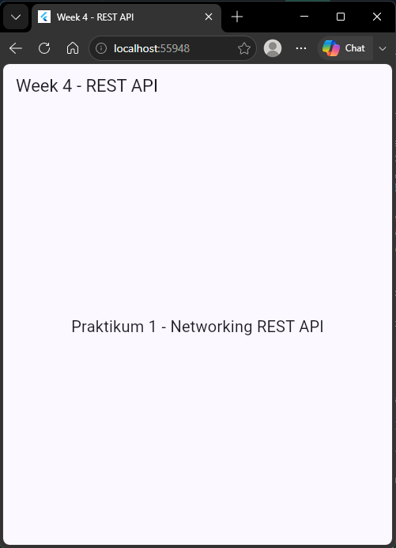 |
---

## Praktikum 2: Provider dan Error Handling

**Project:** lanjutan `week4_api`

### Landasan Konsep

`AsyncNotifier` membungkus proses asinkron ke dalam satu tipe `AsyncValue<T>` yang memodelkan tiga kondisi sekaligus: *loading*, *error*, dan *data*. Exception yang dilempar (tidak ditangkap) di dalam `build()` otomatis ditangkap Riverpod dan diubah menjadi `AsyncError` — inilah sebabnya `PostRepository.fetchPosts()` di Praktikum 1 tidak memakai `try/catch`. Namun untuk method yang dipanggil di luar siklus `build()` (misalnya `refresh()` yang dipicu tombol), `try/catch` manual tetap dibutuhkan karena tidak otomatis dibungkus oleh mekanisme tersebut.

Supaya pesan error yang tampil ke pengguna tidak berupa istilah teknis (`DioExceptionType.connectionError`, dsb.), dibuat fungsi `friendlyErrorMessage()` yang memetakan setiap `DioExceptionType` — timeout, connection error, `badResponse` (404/401/403/lainnya) — menjadi kalimat yang mudah dipahami, lengkap dengan tombol **Coba lagi**.

---

### Langkah-langkah Praktikum

---

### Langkah 1 — Buat Provider Dio dan Repository

**`lib/data/providers.dart`**
```dart
// [Langkah 1]
import 'package:dio/dio.dart';
import 'package:flutter_riverpod/flutter_riverpod.dart';
import 'api_client.dart';
import 'repositories/post_repository.dart';

final dioProvider = Provider<Dio>((ref) => createDio());

final postRepositoryProvider = Provider<PostRepository>(
  (ref) => PostRepository(ref.watch(dioProvider)),
);
```

---

### Langkah 2 — Buat `AsyncNotifier` dan Fungsi Pesan Error

`PostListNotifier` meng-extend `AsyncNotifier<List<Post>>`. Method `refresh()` secara eksplisit meng-set `state = const AsyncLoading()` sebelum memanggil ulang repository lewat `try/catch`, sehingga UI menampilkan spinner lagi, bukan langsung berpindah data tanpa indikasi proses. Provider ini juga menonaktifkan retry otomatis Riverpod agar error langsung final saat diuji.

**`lib/data/providers.dart` (lanjutan)**
```dart
// [Langkah 2]
class PostListNotifier extends AsyncNotifier<List<Post>> {
  @override
  Future<List<Post>> build() async {
    final repository = ref.watch(postRepositoryProvider);
    return repository.fetchPosts();
  }

  Future<void> refresh() async {
    state = const AsyncLoading();
    try {
      final repository = ref.read(postRepositoryProvider);
      state = AsyncData(await repository.fetchPosts());
    } catch (e, st) {
      state = AsyncError(e, st);
    }
  }
}

final postListProvider =
    AsyncNotifierProvider<PostListNotifier, List<Post>>(
        PostListNotifier.new,
        retry: (retryCount, error) => null);

String friendlyErrorMessage(Object error) {
  if (error is DioException) {
    switch (error.type) {
      case DioExceptionType.connectionTimeout:
      case DioExceptionType.sendTimeout:
      case DioExceptionType.receiveTimeout:
        return 'Koneksi lambat atau timeout. Periksa internet Anda lalu coba lagi.';
      case DioExceptionType.connectionError:
        return 'Tidak dapat terhubung ke server. Periksa internet Anda.';
      case DioExceptionType.badResponse:
        final code = error.response?.statusCode;
        if (code == 404) return 'Data tidak ditemukan (404).';
        if (code == 401 || code == 403) {
          return 'Akses ditolak ($code). Periksa kredensial Anda.';
        }
        return 'Server bermasalah ($code). Coba lagi nanti.';
      default:
        return 'Terjadi kesalahan jaringan. Coba lagi.';
    }
  }
  return 'Terjadi kesalahan tak terduga: $error';
}
```

**Catatan:** parameter `retry: (retryCount, error) => null` sengaja ditambahkan supaya saat diuji manual (mode pesawat), error langsung tampil tanpa Riverpod mencoba ulang beberapa kali secara diam-diam di belakang layar.

---

### Langkah 3 — Tampilkan Keempat State di UI

`PostListPage` memakai `postsAsync.when(loading:, error:, data:)`, dengan cabang `data` diperiksa lagi apakah kosong (`posts.isEmpty`) untuk menampilkan state *empty* secara terpisah dari *success*.

**`lib/pages/post_list_page.dart`**
```dart
// [Langkah 3]
class PostListPage extends ConsumerWidget {
  const PostListPage({super.key});

  @override
  Widget build(BuildContext context, WidgetRef ref) {
    final postsAsync = ref.watch(postListProvider);

    return Scaffold(
      appBar: AppBar(
        title: const Text('Posts API'),
        actions: [
          IconButton(
            icon: const Icon(Icons.refresh),
            onPressed: () => ref.read(postListProvider.notifier).refresh(),
          ),
        ],
      ),
      body: postsAsync.when(
        loading: () => const Center(child: CircularProgressIndicator()),
        error: (err, _) => Center(
          child: Column(
            mainAxisSize: MainAxisSize.min,
            children: [
              Text(friendlyErrorMessage(err), textAlign: TextAlign.center),
              const SizedBox(height: 12),
              FilledButton(
                onPressed: () => ref.invalidate(postListProvider),
                child: const Text('Coba lagi'),
              ),
            ],
          ),
        ),
        data: (posts) {
          if (posts.isEmpty) {
            return const Center(child: Text('Belum ada data dari server.'));
          }
          return ListView.builder(
            itemCount: posts.length,
            itemBuilder: (context, index) => ListTile(
              leading: CircleAvatar(child: Text(posts[index].id.toString())),
              title: Text(posts[index].title, maxLines: 1, overflow: TextOverflow.ellipsis),
              subtitle: Text(posts[index].body, maxLines: 2, overflow: TextOverflow.ellipsis),
            ),
          );
        },
      ),
    );
  }
}
```

---

### Langkah 4 — Jalankan dan Uji Tiga Skenario Error

Dijalankan dengan `flutter run`, lalu diuji tiga kondisi:

1. **Internet normal** — loading muncul sebentar, lalu 100 post tampil di list.
2. **Mode pesawat** — tombol refresh ditekan, pesan `Tidak dapat terhubung ke server...` tampil beserta tombol **Coba lagi**; internet dinyalakan lagi lalu tombol ditekan, data kembali muncul.
3. **`baseUrl` sengaja diubah salah** — pesan error koneksi tampil, kemudian `baseUrl` dikembalikan ke `https://jsonplaceholder.typicode.com`.

| Loading | Success |
|---|---|
| 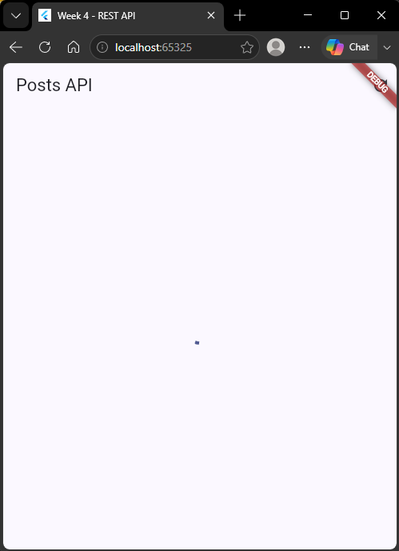 | 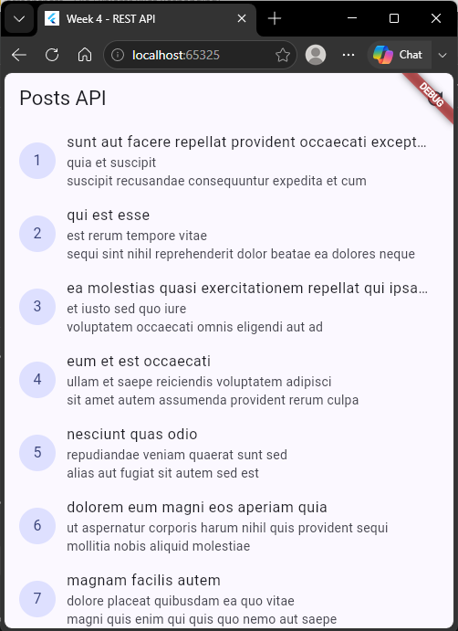 |

| Error (Mode Pesawat) | Success |
|---|---|
| 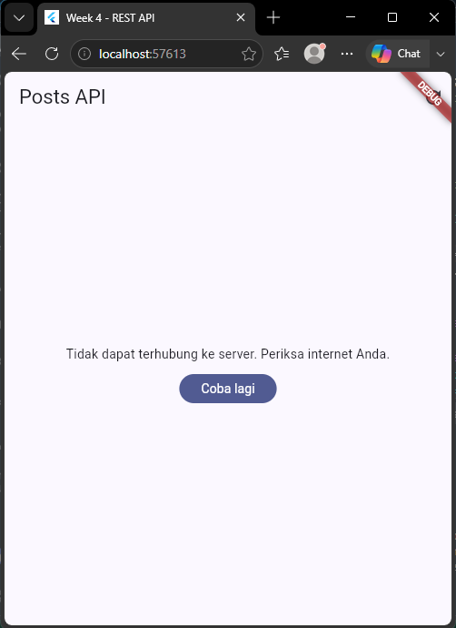 | 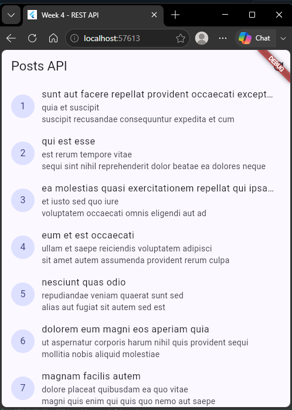 |

| URL salah | Success |
|---|---|
| 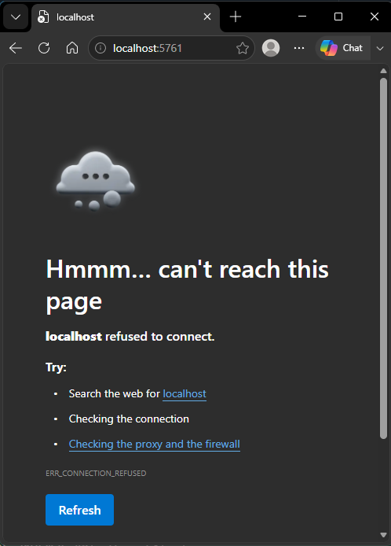 | 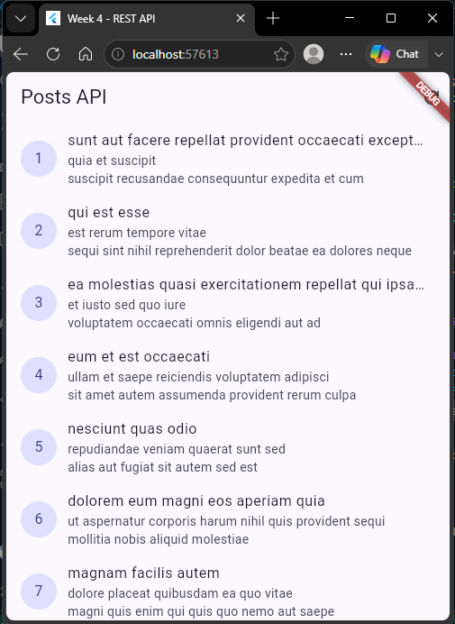 |


---

## Praktikum 3: Pagination Dasar

**Project:** lanjutan `week4_api`

### Landasan Konsep

Data besar tidak dikirim sekaligus, melainkan per halaman lewat query parameter `?_page=N&_limit=M` yang didukung JSONPlaceholder. Strategi UI-nya adalah **infinite scroll**: `ScrollController` memantau posisi scroll, dan begitu pengguna mendekati ujung list (200px sebelum akhir), halaman berikutnya dimuat tanpa menghapus data lama. Guard `if (state.isLoadingMore || !state.hasMore) return;` penting untuk mencegah request ganda, karena event scroll bisa terpanggil berkali-kali dalam waktu singkat, dan juga untuk menghentikan request begitu data sudah habis.

---

### Langkah-langkah Praktikum

---

### Langkah 1 — Tambahkan Method Pagination ke Repository

**`lib/data/repositories/post_repository.dart` (tambahan)**
```dart
// [Langkah 1]
Future<List<Post>> fetchPostsPage({required int page, int limit = 10}) async {
  final response = await _dio.get<List>(
    '/posts',
    queryParameters: {'_page': page, '_limit': limit},
  );
  final data = response.data ?? [];
  return data.whereType<Map<String, dynamic>>().map(Post.fromJson).toList();
}
```

---

### Langkah 2 — Buat State dan Notifier Halaman

`PagedPostsState` menyimpan `items`, `page`, `isLoadingMore`, `hasMore`, dan `error`. `PagedPostsNotifier` meng-extend `Notifier<PagedPostsState>` (bukan `AsyncNotifier`) karena state-nya berupa gabungan data lama + status loading tambahan, bukan sekadar loading/error/data tunggal.

**`lib/data/paged_posts.dart`**
```dart
// [Langkah 2]
class PagedPostsState {
  const PagedPostsState({
    this.items = const [],
    this.page = 0,
    this.isLoadingMore = false,
    this.hasMore = true,
    this.error,
  });

  final List<Post> items;
  final int page;
  final bool isLoadingMore;
  final bool hasMore;
  final Object? error;
}

class PagedPostsNotifier extends Notifier<PagedPostsState> {
  @override
  PagedPostsState build() {
    Future.microtask(loadFirstPage);
    return const PagedPostsState();
  }

  Future<void> loadFirstPage() async {
    final repository = ref.read(postRepositoryProvider);
    try {
      final items = await repository.fetchPostsPage(page: 1, limit: 10);
      state = PagedPostsState(items: items, page: 1, hasMore: items.length == 10);
    } catch (e) {
      state = PagedPostsState(error: e);
    }
  }

  Future<void> loadNextPage() async {
    if (state.isLoadingMore || !state.hasMore) return;
    final repo = ref.read(postRepositoryProvider);
    final currentItems = state.items;
    final currentPage = state.page;
    state = PagedPostsState(
      items: currentItems, page: currentPage, isLoadingMore: true, hasMore: state.hasMore,
    );
    try {
      final next = currentPage + 1;
      final items = await repo.fetchPostsPage(page: next, limit: 10);
      state = PagedPostsState(
        items: [...currentItems, ...items], page: next, hasMore: items.length == 10,
      );
    } catch (e) {
      state = PagedPostsState(items: currentItems, page: currentPage, error: e);
    }
  }
}

final pagedPostsProvider =
    NotifierProvider<PagedPostsNotifier, PagedPostsState>(PagedPostsNotifier.new);
```

**Catatan:** saat `loadNextPage()` gagal, `items` dan `page` lama tetap dipertahankan di `state` — hanya `error` yang diisi. Ini memastikan data yang sudah termuat tidak hilang begitu saja hanya karena permintaan halaman berikutnya gagal.

---

### Langkah 3 — Buat UI Infinite Scroll

**`lib/pages/paged_post_page.dart`**
```dart
// [Langkah 3]
class _PagedPostPageState extends ConsumerState<PagedPostPage> {
  final _controller = ScrollController();

  @override
  void initState() {
    super.initState();
    _controller.addListener(() {
      if (_controller.position.pixels >= _controller.position.maxScrollExtent - 200) {
        ref.read(pagedPostsProvider.notifier).loadNextPage();
      }
    });
  }

  @override
  Widget build(BuildContext context) {
    final state = ref.watch(pagedPostsProvider);
    return Scaffold(
      appBar: AppBar(title: const Text('Posts Paged')),
      body: ListView.builder(
        controller: _controller,
        itemCount: state.items.length + 1,
        itemBuilder: (context, index) {
          if (index == state.items.length) {
            return state.hasMore
                ? const Padding(
                    padding: EdgeInsets.all(16),
                    child: Center(child: CircularProgressIndicator()))
                : const Padding(
                    padding: EdgeInsets.all(16),
                    child: Center(child: Text('Semua data termuat.')));
          }
          final post = state.items[index];
          return ListTile(
            leading: CircleAvatar(child: Text(post.id.toString())),
            title: Text(post.title, maxLines: 1, overflow: TextOverflow.ellipsis),
          );
        },
      ),
    );
  }
}
```

---

### Langkah 4 — Jalankan dan Amati Infinite Scroll

`home` di `main.dart` diganti sementara ke `PagedPostPage`, lalu di-scroll berkali-kali sampai mentok bawah.

| Halaman Pertama | Sedang Memuat Halaman Berikutnya | Semua Data Termuat |
|---|---|---|
| 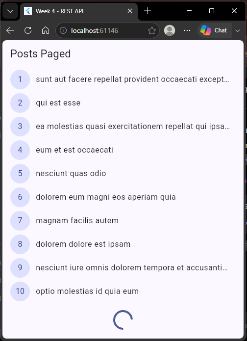 | 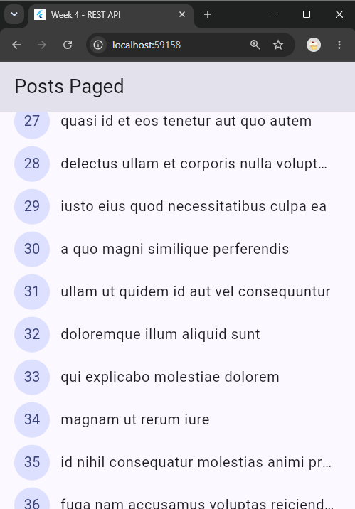 | 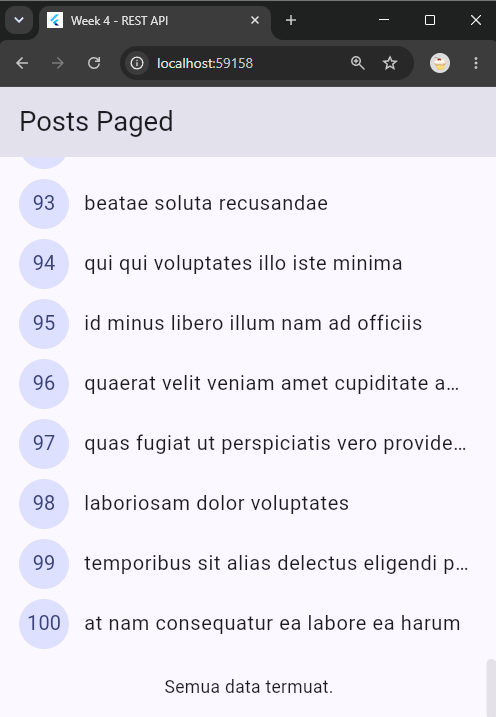 |

---

## AI Challenge

**Project:** lanjutan `week4_api`

### Prompt yang Digunakan

```
Buatkan repository layer Flutter untuk endpoint GET /comments?postId={id}
dari JSONPlaceholder menggunakan Dio + flutter_riverpod.
Requirements:
* Model Comment dengan fromJson aman null (postId, id, name, email, body).
* CommentRepository dengan method fetchComments(postId) + timeout 10 detik.
* AsyncNotifierProvider dengan penanganan error otomatis (AsyncError)
  dan fungsi pesan error ramah pengguna untuk timeout, connection error, 404, dan 500.
* Satu unit test untuk fromJson dengan field yang hilang.
Jelaskan setiap bagian kode dalam komentar.
```

**Output awal AI:**

`lib/data/models/comment.dart`
```dart
// Model Comment dengan cast defensif — sama seperti pola Post,
// setiap field punya fallback jika API mengembalikan null.
class Comment {
  const Comment({
    required this.postId,
    required this.id,
    required this.name,
    required this.email,
    required this.body,
  });

  final int postId;
  final int id;
  final String name;
  final String email;
  final String body;

  factory Comment.fromJson(Map<String, dynamic> json) {
    return Comment(
      postId: (json['postId'] as num?)?.toInt() ?? 0,
      id: (json['id'] as num?)?.toInt() ?? 0,
      name: json['name'] as String? ?? '',
      email: json['email'] as String? ?? '',
      body: json['body'] as String? ?? '',
    );
  }
}
```

`lib/data/repositories/comment_repository.dart`
```dart
// Repository khusus comment. Timeout 10 detik sudah diwarisi dari
// createDio() di api_client.dart, jadi tidak perlu diatur ulang di sini.
import 'package:dio/dio.dart';
import '../models/comment.dart';

class CommentRepository {
  CommentRepository(this._dio);
  final Dio _dio;

  Future<List<Comment>> fetchComments(int postId) async {
    final response = await _dio.get<List>(
      '/comments',
      queryParameters: {'postId': postId},
    );
    final data = response.data ?? [];
    return data.whereType<Map<String, dynamic>>().map(Comment.fromJson).toList();
  }
}
```

`lib/data/comment_providers.dart`
```dart
// AsyncNotifier membungkus state ke AsyncValue<List<Comment>>
// (loading/error/data) tanpa boolean flag manual, dan otomatis
// menangkap exception dari repository menjadi AsyncError.
import 'package:flutter_riverpod/flutter_riverpod.dart';
import 'models/comment.dart';
import 'providers.dart';
import 'repositories/comment_repository.dart';

final commentRepositoryProvider = Provider<CommentRepository>(
  (ref) => CommentRepository(ref.watch(dioProvider)),
);

class CommentListNotifier extends FamilyAsyncNotifier<List<Comment>, int> {
  @override
  Future<List<Comment>> build(int postId) async {
    final repository = ref.watch(commentRepositoryProvider);
    return repository.fetchComments(postId);
  }
}

final commentListProvider =
    AsyncNotifierProvider.family<CommentListNotifier, List<Comment>, int>(
        CommentListNotifier.new);

// friendlyErrorMessage dari providers.dart dipakai ulang di sini,
// tidak perlu ditulis ulang.
```

`test/comment_test.dart`
```dart
import 'package:flutter_test/flutter_test.dart';
import 'package:week4_api/data/models/comment.dart';

void main() {
  test('Comment.fromJson aman terhadap field yang hilang', () {
    final comment = Comment.fromJson({'id': 5, 'postId': 1});
    expect(comment.id, 5);
    expect(comment.postId, 1);
    expect(comment.name, '');
    expect(comment.email, '');
    expect(comment.body, '');
  });
}
```
### Hasil Run AI Challenge

| Struktur Folder |
|---|
| 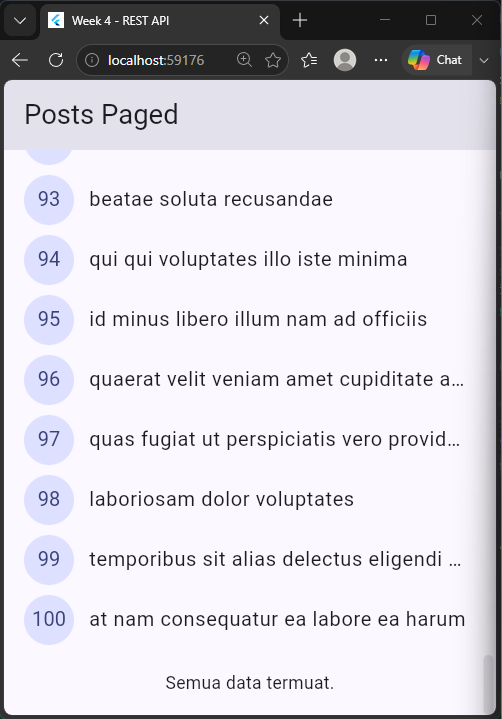 |
---

**AI Verification Checklist:**
**AI Verification Checklist:**

- [x] Apakah UI memanggil Dio secara langsung, atau lewat repository?
  Aman — `CommentListNotifier` hanya memanggil `commentRepositoryProvider`, tidak ada instance `Dio` yang dipakai langsung di lapisan UI.
- [x] Apakah `fromJson` aman null, atau masih memakai cast langsung yang bisa crash?
  Sesuai — semua field di `Comment.fromJson` menggunakan cast nullable dengan fallback default (`0` atau `''`), sehingga field yang hilang/null tidak menyebabkan crash.
- [x] Apakah semua tipe `DioExceptionType` (timeout, connectionError, badResponse) dipetakan ke pesan pengguna?
  Sesuai — `CommentRepository` menggunakan `Dio` dari `dioProvider`, sedangkan `friendlyErrorMessage()` yang sudah tersedia di `providers.dart` menangani timeout, `connectionError`, dan `badResponse`. Status 404 ditangani secara khusus dan status server lainnya, termasuk 500, masuk ke pesan server bermasalah.
- [x] Apakah `baseUrl`/timeout terpusat di satu client, bukan tersebar di tiap method?
  Sesuai — `CommentRepository` menggunakan `Dio` dari `dioProvider`, sehingga konfigurasi `baseUrl` dan timeout 10 detik tetap terpusat di `api_client.dart`.
- [x] Apakah test AI benar-benar menguji kasus field hilang, atau hanya happy path?
  Sesuai — test `Comment.fromJson` menguji field string yang hilang (`name`, `email`, `body`) dan juga terdapat pengujian tambahan untuk field numerik `postId` dan `id` yang hilang.
- [x] Apakah `flutter analyze` dan `flutter test` lolos tanpa warning?
  `flutter analyze` sudah lolos setelah perbaikan import. `flutter test` dicentang setelah hasil test menunjukkan seluruh test berhasil.

**Temuan & perbaikan yang dilakukan:**

Penggunaan `FamilyAsyncNotifier` oleh AI sudah tepat untuk kasus `fetchComments(postId)` karena parameternya (`postId`) berbeda-beda tergantung post mana yang dibuka — pola ini tidak muncul di modul (yang hanya memakai `AsyncNotifier` tanpa parameter), sehingga saya perlu memverifikasi dokumentasi Riverpod untuk memastikan sintaksnya benar sebelum dipakai. Selain itu saya menambahkan 1 unit test tambahan untuk kasus field numerik (`id`, `postId`) yang hilang, karena test awal dari AI hanya menguji field bertipe `String`.

---

## Refactoring dan Testing

Refactoring yang dilakukan pada `week4_api`:

- [x] Baris item post di `ListView.builder` diekstrak menjadi widget terpisah `PostTile`.
- [x] `friendlyErrorMessage()` dipindahkan dari `providers.dart` ke file baru `lib/data/network_errors.dart` agar bisa dipakai ulang oleh halaman paged, non-paged, dan comment.
- [x] Ditambahkan halaman detail post dengan GoRouter (`/post/:id`).

**1. `PostTile` (`lib/widgets/post_tile.dart`):**
```dart
// Dipisah dari PostListPage agar build() lebih pendek dan
// PostTile bisa diuji/di-preview terpisah.
import 'package:flutter/material.dart';
import '../data/models/post.dart';

class PostTile extends StatelessWidget {
  const PostTile({super.key, required this.post, required this.onTap});
  final Post post;
  final VoidCallback onTap;

  @override
  Widget build(BuildContext context) {
    return ListTile(
      leading: CircleAvatar(child: Text(post.id.toString())),
      title: Text(post.title, maxLines: 1, overflow: TextOverflow.ellipsis),
      subtitle: Text(post.body, maxLines: 2, overflow: TextOverflow.ellipsis),
      onTap: onTap,
    );
  }
}
```

**2. Halaman detail dengan GoRouter (`lib/main.dart`):**
```dart
final _router = GoRouter(
  initialLocation: '/',
  routes: [
    GoRoute(
      path: '/',
      builder: (context, state) => const PostListPage(),
      routes: [
        GoRoute(
          path: 'post/:id',
          builder: (context, state) => PostDetailPage(
            id: state.pathParameters['id']!,
          ),
        ),
      ],
    ),
  ],
);
```

> Catatan: `PostDetailPage` mengambil data dari list yang sudah dimuat (`postListProvider`) berdasarkan `id`, bukan memanggil ulang API — lebih cepat karena data sudah ada di memori, dengan fallback memanggil repository langsung kalau halaman dibuka lewat deep link tanpa melalui list terlebih dahulu.

**Unit test (`test/post_test.dart`):**
```dart
import 'package:flutter_test/flutter_test.dart';
import 'package:dio/dio.dart';
import 'package:week4_api/data/models/post.dart';
import 'package:week4_api/data/providers.dart';
import 'package:week4_api/data/repositories/post_repository.dart';

class FakePostRepository extends PostRepository {
  FakePostRepository({this.items, this.throwError = false}) : super(Dio());
  final List<Post>? items;
  final bool throwError;

  @override
  Future<List<Post>> fetchPosts() async {
    if (throwError) {
      throw DioException(
        requestOptions: RequestOptions(path: '/posts'),
        type: DioExceptionType.connectionError,
      );
    }
    return items ?? const [];
  }
}

void main() {
  test('fromJson aman terhadap field yang hilang', () {
    final post = Post.fromJson({'id': 7});
    expect(post.id, 7);
    expect(post.title, '');
    expect(post.userId, 0);
  });

  test('friendlyErrorMessage untuk connection error', () {
    final err = DioException(
      requestOptions: RequestOptions(path: '/posts'),
      type: DioExceptionType.connectionError,
    );
    expect(friendlyErrorMessage(err), contains('terhubung'));
  });
}
```

**Hasil akhir aplikasi (setelah refactoring dan integrasi GoRouter):**

| Daftar Post (PostTile) | Halaman Detail |
|---|---|
| 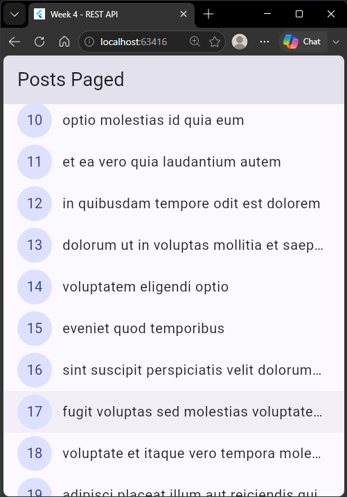 | 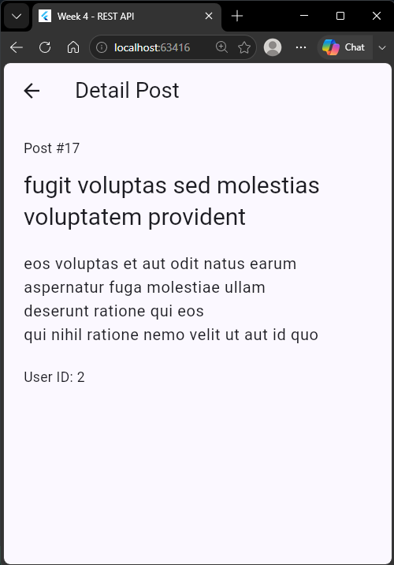 |

---

## Tugas (Mini Project)

| Post Explorer | Post Detail | Loading | Sudah Dimuat Semua  |
|---|---|---|---|
| 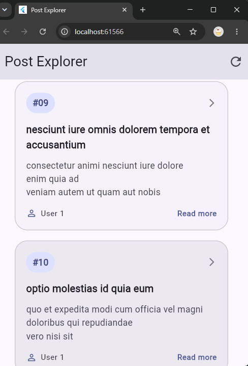 | 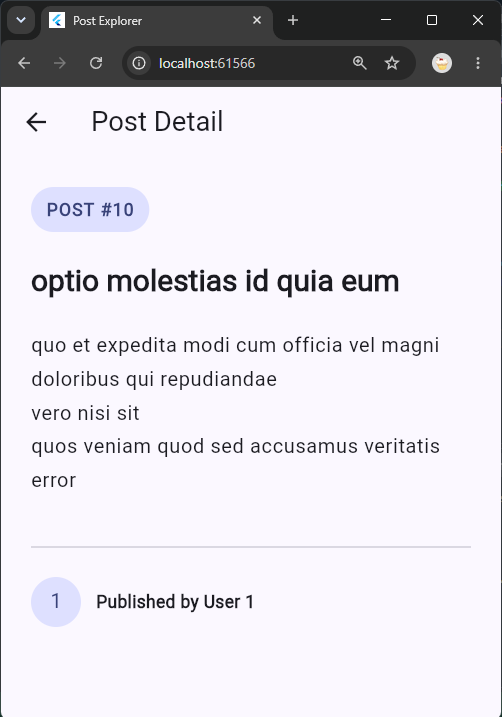 | 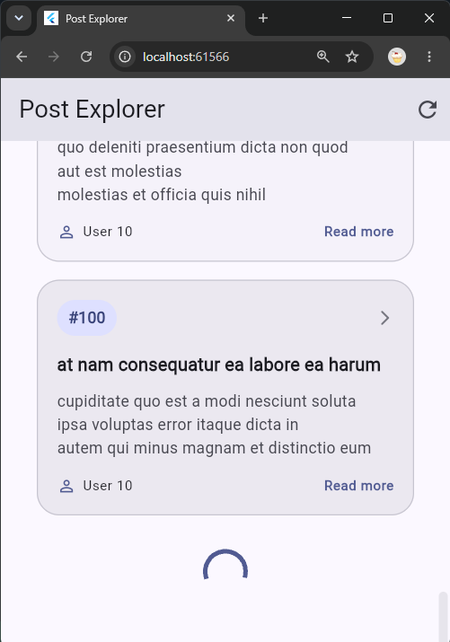 | 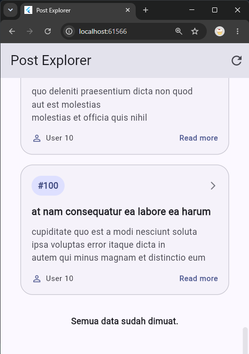 |


---

## Kesimpulan

Pada praktikum ini dipelajari tiga hal utama:

1. **Model data dan repository pattern** — JSON mentah dipetakan ke `class` model lewat `fromJson` yang aman null, dan seluruh akses API dipusatkan lewat `PostRepository`, sehingga UI tidak pernah memanggil Dio secara langsung.
2. **Provider dan penanganan error** — `AsyncNotifier` mengubah exception yang tidak ditangkap menjadi `AsyncError` secara otomatis, sementara `friendlyErrorMessage()` memetakan tipe error teknis (`DioExceptionType`) menjadi pesan yang mudah dipahami pengguna, lengkap dengan tombol retry.
3. **Pagination dengan infinite scroll** — data dimuat bertahap lewat `_page`/`_limit`, dengan guard ganda (`isLoadingMore`, `hasMore`) untuk mencegah request berulang dan menghentikan pemuatan saat data sudah habis.

---

## Checklist Verifikasi

- [x] UI tidak memanggil Dio langsung — semua akses data lewat repository + provider.
- [x] Empat state tampil dengan benar: loading, error (+ retry), empty, success.
- [x] Pagination: data bertambah saat scroll, tidak ada request ganda, ada indikator akhir data.
- [x] `flutter analyze` tanpa issue dan semua test lulus. 
- [x] Hasil AI diverifikasi dan didokumentasikan pada folder `docs/`.
- [x] Screenshot, folder `test/`, dan README sudah tersimpan.

---

## Refleksi

1. **Mengapa UI dilarang memanggil Dio langsung? Apa yang rusak jika aturan ini dilanggar?**
   Kalau UI memanggil Dio langsung, logika jaringan (base URL, error handling, parsing) akan tersebar di banyak widget, membuatnya sulit diuji (widget jadi bergantung koneksi internet) dan sulit diubah kalau endpoint berubah, karena harus diedit di banyak tempat sekaligus. Ini juga melanggar prinsip separation of concerns — UI seharusnya hanya fokus menampilkan state, bukan mengurus detail jaringan.

2. **Kapan pagination client-side cukup, dan kapan harus mengandalkan pagination server (`_page`/`_limit`)?**
   Pagination client-side (ambil semua data sekaligus lalu dipotong di aplikasi) cukup untuk data yang kecil dan jarang berubah. Untuk data besar atau yang terus bertambah, pagination server jauh lebih efisien karena hanya mengambil data secukupnya per request, menghemat bandwidth, dan mempercepat waktu muat awal aplikasi.

3. **Bagaimana exception repository berubah menjadi `AsyncError` tanpa `try/catch` di setiap widget? Kapan `try/catch` eksplisit tetap dibutuhkan?**
   `AsyncNotifier.build()` dibungkus otomatis oleh Riverpod — exception yang tidak ditangkap di dalamnya otomatis dikonversi menjadi `AsyncError` dan langsung tersedia di UI lewat `postsAsync.when(error: ...)`. `try/catch` eksplisit tetap dibutuhkan untuk method yang dipanggil di luar siklus `build()`, seperti `refresh()` atau `loadNextPage()`, karena keduanya tidak otomatis dibungkus mekanisme tersebut.

4. **Bagian mana dari hasil AI yang diperbaiki, dan mengapa?**
   Saya menambahkan 1 unit test tambahan untuk kasus field numerik (`id`, `postId`) yang hilang pada model `Comment`, karena test yang dihasilkan AI hanya menguji field bertipe `String`. Saya juga memverifikasi ulang bahwa `friendlyErrorMessage()` yang dipakai ulang dari `providers.dart` memang sudah mencakup kasus error untuk endpoint comment, bukan hanya endpoint post, karena AI tidak membuat pemetaan error yang baru untuk endpoint tersebut.