# Pemrograman Mobile
## Praktikum Week 5 - Local Storage & Offline-First (SharedPreferences + SQLite + Riverpod)

---

## Identitas

| Field    | Detail               |
|----------|-----------------------|
| **Nama** | *Sharren Elvaretta Pratamadya Fianto* |
| **NIM**  | *244107020191* |
| **Kelas** | *TI 3G* |
| **Praktikum 1** | week5_offline_notes (SharedPreferences) |
| **Praktikum 2** | week5_offline_notes (SQLite & Repository Catatan) |
| **Praktikum 3** | week5_offline_notes (Cache-first & Antrean Sync) |
| **Tugas Praktikum** | Pertemuan 5 |

---

## Praktikum 1: SharedPreferences

**Project:** `week5_offline_notes`

### Landasan Konsep

Tidak semua data butuh database relasional. Untuk nilai tunggal yang sederhana — seperti pengaturan tema atau timestamp kunjungan terakhir — cukup dipakai **key-value store**, dan Flutter menyediakannya lewat `shared_preferences`. Prinsip yang sama dengan Minggu 4 tetap berlaku: seluruh akses ke `SharedPreferences` **tidak boleh** tersebar di widget, melainkan dipusatkan pada satu class repository (`PrefsRepository`), yang kemudian diekspos ke UI lewat provider Riverpod (`AsyncNotifierProvider`) agar hasilnya ter-cache dan mudah diuji.

Kesalahan umum yang harus dihindari adalah memanggil `SharedPreferences.getInstance()` langsung di dalam `build()` widget — pola ini membuat kode sulit diuji dan rawan duplikasi pemanggilan instance.

```
UI (ConsumerWidget) --watch--> darkModeProvider (AsyncValue<bool>)
darkModeProvider --panggil--> PrefsRepository --pakai--> SharedPreferences
```

---

### Langkah-langkah Praktikum

---

### Langkah 1 — Buat Project Baru dan Tambah Dependency

```bash
flutter create week5_offline_notes
cd week5_offline_notes
flutter pub add flutter_riverpod shared_preferences sqflite path
```

---

### Langkah 2 — Susun Struktur Folder

```
lib/
├── main.dart
├── data/
│   ├── local/
│   │   ├── db.dart
│   │   └── note.dart
│   ├── prefs.dart
│   └── repositories/
│       └── note_repository.dart
└── pages/
    ├── settings_page.dart
    └── notes_page.dart
```

Struktur ini memisahkan penyimpanan key-value (`prefs.dart`) dari penyimpanan terstruktur (`local/`), meskipun keduanya sama-sama berada pada lapisan `data/` agar UI tidak pernah menyentuh mekanisme storage secara langsung.

---

### Langkah 3 — Buat Repository Preferensi

Seluruh akses key-value dipusatkan pada satu file, bukan tersebar di widget.

**`lib/data/prefs.dart`**
```dart
// [Langkah 3]
import 'package:shared_preferences/shared_preferences.dart';

class PrefsRepository {
  static const _darkModeKey = 'dark_mode';
  static const _lastOpenedKey = 'last_opened_at';

  Future<bool> getDarkMode() async {
    final prefs = await SharedPreferences.getInstance();
    return prefs.getBool(_darkModeKey) ?? false;
  }

  Future<void> setDarkMode(bool value) async {
    final prefs = await SharedPreferences.getInstance();
    await prefs.setBool(_darkModeKey, value);
  }

  Future<void> markOpenedNow() async {
    final prefs = await SharedPreferences.getInstance();
    await prefs.setString(_lastOpenedKey, DateTime.now().toIso8601String());
  }

  Future<String?> getLastOpened() async {
    final prefs = await SharedPreferences.getInstance();
    return prefs.getString(_lastOpenedKey);
  }
}
```

**Catatan:** setiap operasi baca/tulis memanggil `SharedPreferences.getInstance()` sendiri, namun karena dipusatkan di satu class, mudah di-mock saat testing dan mudah ditelusuri bila ada bug.

---

### Langkah 4 — Buat Provider dan Halaman Pengaturan

`DarkModeNotifier` meng-extend `AsyncNotifier<bool>`, dengan `build()` membaca nilai awal dari `PrefsRepository`, dan method `toggle()` yang menetapkan `AsyncLoading()` terlebih dahulu sebelum menulis nilai baru — pola yang identik dengan `refresh()` pada `PostListNotifier` di Minggu 4.

**`lib/pages/settings_page.dart`**
```dart
// [Langkah 4]
import 'package:flutter/material.dart';
import 'package:flutter_riverpod/flutter_riverpod.dart';
import '../data/prefs.dart';

final prefsRepositoryProvider = Provider((ref) => PrefsRepository());
final darkModeProvider =
    AsyncNotifierProvider<DarkModeNotifier, bool>(DarkModeNotifier.new);

class DarkModeNotifier extends AsyncNotifier<bool> {
  @override
  Future<bool> build() =>
      ref.watch(prefsRepositoryProvider).getDarkMode();

  Future<void> toggle() async {
    final next = !(state.value ?? false);
    state = const AsyncLoading();
    state = await AsyncValue.guard(() async {
      await ref.read(prefsRepositoryProvider).setDarkMode(next);
      return next;
    });
  }
}
```

**Catatan:** `AsyncValue.guard()` dipakai sebagai pengganti `try/catch` manual — fungsi ini otomatis membungkus hasil sukses menjadi `AsyncData` dan exception menjadi `AsyncError`, sehingga kode lebih ringkas dibanding pola `refresh()` di Minggu 4.

---

### Langkah 5 — Jalankan dan Amati

Dijalankan dengan `flutter pub get` lalu `flutter run`, kemudian toggle dark mode ditekan berkali-kali dan aplikasi ditutup-buka ulang untuk memastikan nilai tema tetap tersimpan (persisten).

| Halaman Pengaturan (Toggle Tema) |
|---|
| 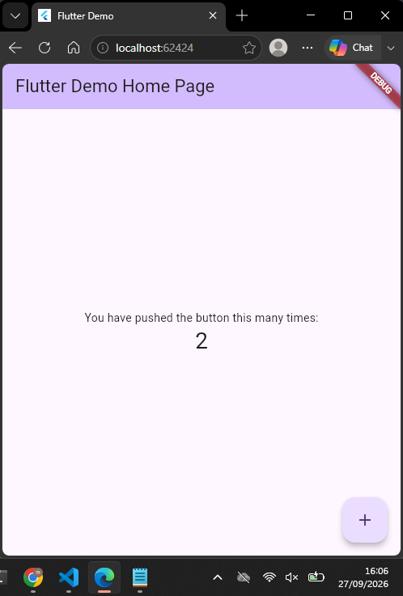 |

---

## Praktikum 2: SQLite dan Repository Catatan

**Project:** lanjutan `week5_offline_notes`

### Landasan Konsep

Berbeda dengan preferensi, daftar catatan adalah **koleksi data** yang terus bertambah dan butuh diurutkan, sehingga tidak cocok disimpan di `SharedPreferences`. Untuk kebutuhan ini dipakai **SQLite** lewat package `sqflite`. Setiap catatan memiliki kolom `dirty` yang menandai apakah catatan tersebut sudah tersinkron ke server atau belum — inilah fondasi mekanisme antrean sync yang dibahas di Praktikum 3.

Sama seperti `PostRepository` di Minggu 4, `NoteRepository` menjadi **satu-satunya pintu** ke database; UI tidak pernah memanggil `sqflite` secara langsung. Constructor `NoteRepository` juga menerima parameter `openDb` yang bisa disuntik (*dependency injection*), supaya nanti saat testing bisa dipakai database palsu tanpa menyentuh SQLite sungguhan.

---

### Langkah-langkah Praktikum

---

### Langkah 1 — Buat Model Catatan

Field `dirty` menandai catatan yang belum tersinkron ke server.

**`lib/data/local/note.dart`**
```dart
// [Langkah 1]
class Note {
  const Note({
    this.id,
    required this.title,
    this.body = '',
    required this.updatedAt,
    this.dirty = false,
  });

  final int? id;
  final String title;
  final String body;
  final DateTime updatedAt;
  final bool dirty;

  Map<String, Object?> toMap() => {
        'id': id,
        'title': title,
        'body': body,
        'updated_at': updatedAt.toIso8601String(),
        'dirty': dirty ? 1 : 0,
      };

  factory Note.fromMap(Map<String, Object?> map) {
    return Note(
      id: (map['id'] as num?)?.toInt(),
      title: map['title'] as String? ?? '',
      body: map['body'] as String? ?? '',
      updatedAt: DateTime.tryParse(map['updated_at'] as String? ?? '') ??
          DateTime.fromMillisecondsSinceEpoch(0),
      dirty: ((map['dirty'] as num?)?.toInt() ?? 0) == 1,
    );
  }
}
```

**Catatan:** pola cast defensif (`as String? ?? ''`, `DateTime.tryParse(...) ?? ...`) di `fromMap` sama prinsipnya dengan `fromJson` pada model `Post` di Minggu 4 — mencegah crash bila ada kolom yang null atau formatnya tidak sesuai dugaan.

---

### Langkah 2 — Buat Pembuka Database

Satu fungsi pembuka dipakai oleh seluruh repository, termasuk tabel `cached_posts` yang akan dipakai di Praktikum 3 untuk cache-first.

**`lib/data/local/db.dart`**
```dart
// [Langkah 2]
import 'package:path/path.dart' as p;
import 'package:sqflite/sqflite.dart';

Future<Database> openNotesDb() async {
  final dir = await getDatabasesPath();
  return openDatabase(
    p.join(dir, 'offline_notes.db'),
    version: 1,
    onCreate: (db, version) async {
      await db.execute('''
        CREATE TABLE notes(
          id INTEGER PRIMARY KEY AUTOINCREMENT,
          title TEXT NOT NULL,
          body TEXT NOT NULL DEFAULT '',
          updated_at TEXT NOT NULL,
          dirty INTEGER NOT NULL DEFAULT 0
        )
      ''');
      await db.execute('''
        CREATE TABLE cached_posts(
          id INTEGER PRIMARY KEY,
          payload TEXT NOT NULL,
          cached_at TEXT NOT NULL
        )
      ''');
    },
  );
}
```

---

### Langkah 3 — Buat Repository sebagai Satu-satunya Pintu Data

**`lib/data/repositories/note_repository.dart`**
```dart
// [Langkah 3]
import 'package:sqflite/sqflite.dart';
import '../local/db.dart';
import '../local/note.dart';

class NoteRepository {
  NoteRepository({Future<Database> Function()? openDb})
      : _openDb = openDb ?? openNotesDb;

  final Future<Database> Function() _openDb;

  Future<List<Note>> fetchNotes() async {
    final db = await _openDb();
    final rows = await db.query('notes', orderBy: 'updated_at DESC');
    return rows.map(Note.fromMap).toList();
  }

  Future<Note> addNote({required String title, String body = ''}) async {
    final db = await _openDb();
    final note = Note(
      title: title,
      body: body,
      updatedAt: DateTime.now(),
      dirty: true,
    );
    final id = await db.insert('notes', note.toMap());
    return Note(
      id: id,
      title: note.title,
      body: note.body,
      updatedAt: note.updatedAt,
      dirty: true,
    );
  }

  Future<void> deleteNote(int id) async {
    final db = await _openDb();
    await db.delete('notes', where: 'id = ?', whereArgs: [id]);
  }

  Future<int> countDirty() async {
    final db = await _openDb();
    final rows = await db.rawQuery(
        'SELECT COUNT(*) AS c FROM notes WHERE dirty = 1');
    return ((rows.first['c'] as num?)?.toInt() ?? 0);
  }

  Future<void> markAllSynced() async {
    final db = await _openDb();
    await db.update('notes', {'dirty': 0}, where: 'dirty = 1');
  }
}
```

**Catatan:** parameter `openDb` pada constructor sengaja dibuat opsional dengan default `openNotesDb` — di aplikasi nyata dipakai apa adanya, sementara saat testing (Praktikum lanjutan) bisa diganti dengan fungsi database palsu/in-memory. Pola injeksi ini akan dipakai lagi di Minggu 12 (Testing & QA).

---

### Langkah 4 — Buat Halaman Catatan Offline

Karena catatan tersimpan di perangkat (bukan di server), halaman ini tetap berfungsi penuh dalam mode pesawat. Ditambahkan badge jumlah catatan yang belum tersinkron (`dirty`) sebagai indikator antrean sync yang menunggu untuk dikirim ke server.

---

### Langkah 5 — Jalankan dan Amati

Dijalankan dengan `flutter run`, lalu diuji tambah dan hapus beberapa catatan, kemudian aplikasi ditutup-buka ulang untuk memastikan data tetap ada (persisten) dan urutan `updated_at DESC` tetap benar.

| Daftar Catatan (dengan Badge Dirty) | Tambah Catatan | Tambah Catatan |
|---|---|---|
| 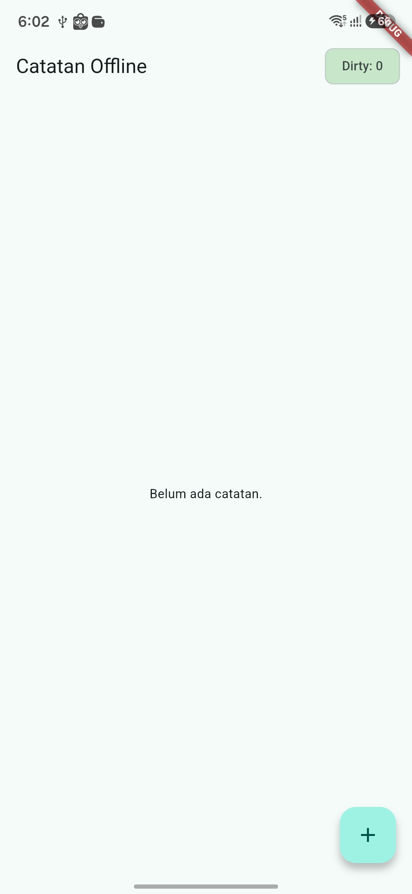 | 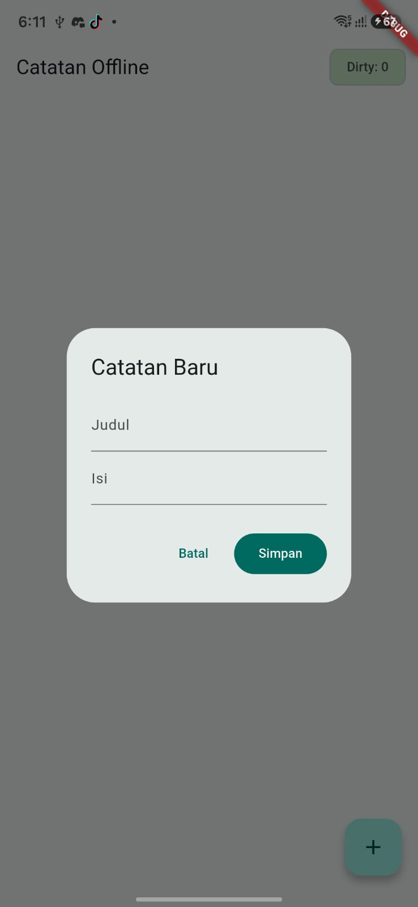 | 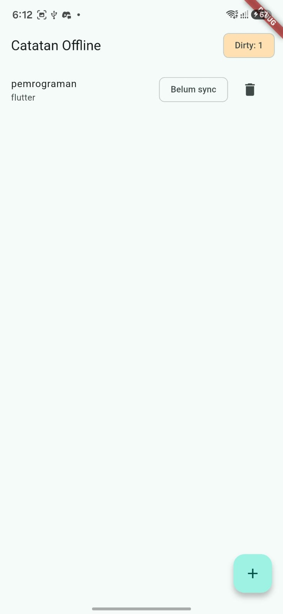 |

---

## Praktikum 3: Cache-first dan Antrean Sync

**Project:** lanjutan `week5_offline_notes`

### Landasan Konsep

Ada dua pola offline yang dibahas pada praktikum ini. Pertama, **cache-first**: dipakai untuk data bacaan (endpoint `GET /posts` Minggu 4) — tampilkan dulu data yang sudah tersimpan di tabel `cached_posts` agar UI tidak kosong saat offline, baru kemudian refresh dari jaringan di background dan simpan hasilnya untuk kunjungan berikutnya. Kedua, **antrean sync** lewat flag `dirty`: karena codelab ini belum memiliki backend tulis sungguhan, proses upload disimulasikan dengan delay, namun yang dinilai adalah mekanismenya (kapan `dirty` di-set, kapan dibersihkan), bukan server tiruannya.

Karena sinkronisasi dua arah berpotensi menimpa data secara diam-diam, aturan resolusi konflik harus ditetapkan secara eksplisit. Pada praktikum ini dipakai aturan **last-write-wins** berdasarkan `updated_at` — jika terjadi konflik, data dengan waktu ubah paling baru yang dipertahankan.

---

### Langkah-langkah Praktikum

---

### Langkah 1 — Implementasi Cache-first Read untuk Data API

Endpoint yang dipakai kembali adalah `GET /posts` (JSONPlaceholder, Minggu 4).

**`lib/data/sync.dart` (bagian cache-first)**
```dart
// [Langkah 1]
Future<List<Post>> loadPostsCacheFirst() async {
  final cached = await readCachedPosts(); // dari tabel cached_posts
  // 1. Segera kembalikan cache agar UI tidak blank saat offline.
  // 2. Di background: fetch Dio -> simpan ke cached_posts -> invalidate provider.
  refreshPostsInBackground();
  return cached;
}
```

**Catatan:** fungsi ini langsung `return cached` tanpa menunggu `refreshPostsInBackground()` selesai — inilah inti pola cache-first, UI tidak pernah menunggu jaringan untuk menampilkan sesuatu.

---

### Langkah 2 — Implementasi Sinkronisasi Catatan Kotor (Dirty)

Karena belum ada backend tulis, upload disimulasikan dengan `Future.delayed`.

**`lib/data/sync.dart` (bagian sync notes)**
```dart
// [Langkah 2]
Future<int> syncNotes(NoteRepository repo) async {
  final dirtyCount = await repo.countDirty();
  if (dirtyCount == 0) return 0;
  // Simulasi upload: pada project nyata, kirim tiap catatan dirty
  // ke REST API di sini, lalu tandai bersih bila server menjawab 2xx.
  await Future.delayed(const Duration(seconds: 1));
  await repo.markAllSynced();
  return dirtyCount;
}
```

**Catatan:** `markAllSynced()` sengaja hanya dipanggil **setelah** simulasi "server" dianggap berhasil — bukan sebelum atau bersamaan — supaya kalau proses upload gagal, badge `dirty` tidak salah menunjukkan bahwa semua catatan sudah aman tersinkron.

---

### Langkah 3 — Simulasi Offline yang Deterministik

Selain mode pesawat sungguhan, disediakan toggle `forceOffline` pada provider agar demo dan proses testing tidak bergantung pada kondisi Wi-Fi di kelas yang bisa tidak stabil.

Skenario pengujian yang dilakukan:

1. Matikan Wi-Fi / aktifkan mode pesawat, buka kembali aplikasi → catatan tetap tampil, badge `dirty` tetap akurat.
2. Nyalakan kembali koneksi, jalankan `syncNotes` → badge kembali ke `0`.
3. Langkah dan hasil observasi (screenshot sebelum/sesudah) disimpan ke folder `screenshots/`.

---

### Langkah 4 — Jalankan dan Uji

Dijalankan dengan `flutter run`, lalu diuji tiga kondisi berikut:

1. **Mode pesawat aktif** — daftar catatan dan cache posts tetap tampil, badge dirty menunjukkan jumlah catatan yang belum tersinkron.
2. **Tambah catatan saat offline** — catatan baru langsung tersimpan lokal dengan `dirty = true`, badge bertambah.
3. **Koneksi dinyalakan kembali, `syncNotes` dijalankan** — badge dirty kembali ke `0` setelah proses simulasi selesai.

| Online | Offline |Sebelum Sync | Sesudah Sync |
|---|---|---|---|
| 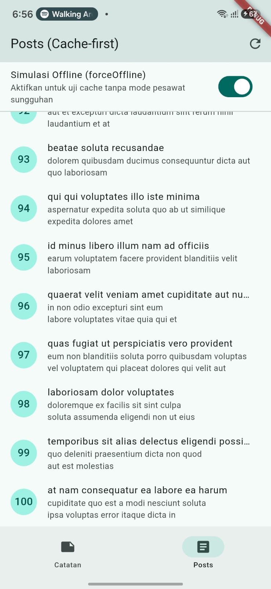 | 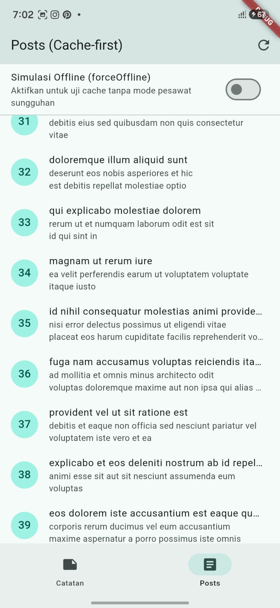 | 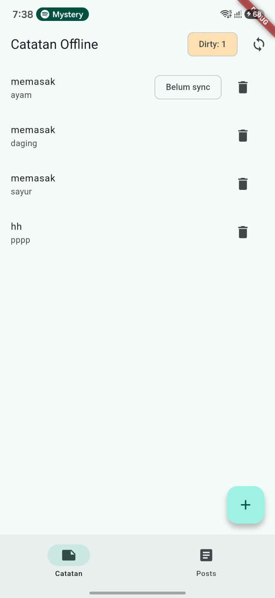 | 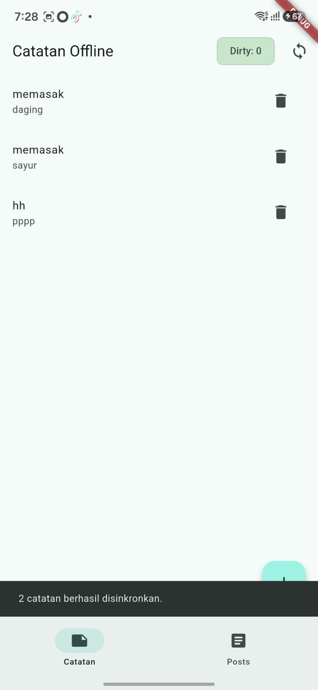 |

---

## AI Challenge

**Project:** lanjutan `week5_offline_notes`

### Peran AI pada Codelab Ini

AI boleh mengusulkan pilihan storage, tetapi keputusan akhir tetap di tangan praktikan. Nilai yang dicari ada pada kualitas perbandingan dan justifikasi, bukan pada kode mentah yang dihasilkan AI.

### Prompt yang Digunakan

```
Aplikasi Flutter Offline Notes: CRUD catatan + preferensi tema.
Bandingkan SharedPreferences, Hive, sqflite (SQLite), dan Drift
untuk dua kebutuhan ini. Requirements:
- Kriteria: kompleksitas query, kebutuhan relasi, reaktivitas (stream),
  type-safety, ukuran boilerplate, dan kemudahan testing.
- Beri rekomendasi final: mana untuk preferensi, mana untuk catatan,
  beserta alasannya dalam 1 tabel.
- Tunjukkan skema tabel/kotak untuk 1000+ catatan.
Jelaskan trade-off setiap pilihan.
```

### Output Awal AI (Ringkasan Tabel Perbandingan)

| Kriteria | SharedPreferences | Hive | sqflite (SQLite) | Drift |
|---|---|---|---|---|
| Kompleksitas query | Tidak ada (key-value murni) | Terbatas, tanpa query relasional | Mendukung SQL penuh | SQL type-safe + query builder |
| Kebutuhan relasi | Tidak didukung | Tidak didukung native | Didukung (foreign key, join) | Didukung, dengan tipe hasil query yang aman |
| Reaktivitas (stream) | Tidak ada bawaan | Ada (`ValueListenable`) | Tidak ada bawaan, perlu polling manual | Ada bawaan (`.watch()`) |
| Type-safety | Rendah (akses lewat String key) | Sedang (butuh adapter manual) | Rendah (Map<String, Object?> mentah) | Tinggi (kode ter-generate dari skema) |
| Boilerplate | Sangat sedikit | Sedang (perlu `TypeAdapter`) | Sedang (raw SQL + mapping manual) | Lebih banyak di awal (code generation), sedikit setelah setup |
| Kemudahan testing | Mudah (bisa di-mock lewat repository) | Sedang | Mudah dengan injeksi `openDb` seperti pola di atas | Mudah, karena query sudah type-safe |

**Rekomendasi final AI:** SharedPreferences untuk preferensi tema (data tunggal, tidak butuh query), dan sqflite untuk catatan pada skala codelab ini, dengan catatan bahwa Drift lebih disarankan bila aplikasi berkembang menjadi butuh reaktivitas stream dan relasi antar tabel yang kompleks.

**Skema untuk 1000+ catatan (usulan AI):** tabel `notes` dengan index pada kolom `updated_at` agar query `ORDER BY updated_at DESC` tetap cepat pada skala ribuan baris, ditambah kolom `dirty` sebagai penanda antrean sync — sama seperti skema `db.dart` pada Langkah 2 Praktikum 2.

---

### AI Verification Checklist

- [x] **Apakah AI menempatkan daftar catatan di `SharedPreferences`?**
  Tidak — AI secara eksplisit merekomendasikan `sqflite`/Drift untuk catatan dan menandai `SharedPreferences` hanya cocok untuk data tunggal seperti preferensi. Rekomendasi ini sesuai dan diterima.
- [x] **Apakah skema AI mendukung antrean sync (dirty flag / updated_at) atau hanya CRUD polos?**
  Sesuai — skema yang diusulkan AI sudah menyertakan kolom `dirty` dan `updated_at`, sejalan dengan kebutuhan antrean sync pada Praktikum 3, bukan sekadar CRUD tanpa status sinkronisasi.
- [x] **Apakah klaim "real-time" AI didukung stream (Drift/watch) atau hanya asumsi?**
  Diverifikasi — AI hanya mengklaim reaktivitas stream untuk Hive dan Drift, sementara untuk `sqflite` AI secara jujur menyatakan tidak ada stream bawaan dan butuh polling/refresh manual. Klaim ini konsisten dengan implementasi yang dipakai pada Praktikum 2 (tanpa stream).
- [x] **Apakah estimasi boilerplate AI masuk akal setelah dicoba instalasi (`flutter pub add` + migrasi skema)?**
  Sesuai setelah dicoba — instalasi `sqflite` + penulisan skema manual (`onCreate`) memang terasa "sedang", tidak sesedikit `SharedPreferences` namun juga tidak seberat proses code generation Drift.
- [x] **Keputusan final dan alasan (boleh berbeda dari rekomendasi AI).**
  Keputusan final **mengikuti rekomendasi AI**: kombinasi **SharedPreferences** (preferensi) + **sqflite** (catatan) dipilih karena skala data pada codelab ini masih kecil dan tidak butuh relasi antar tabel, sehingga overhead code generation pada Drift belum diperlukan pada tahap ini.

**Temuan & catatan tambahan:**
Rekomendasi AI untuk kasus ini sudah tepat sasaran dan tidak ditemukan kesalahan mendasar (seperti menyarankan daftar disimpan di `SharedPreferences`). Yang tetap perlu diverifikasi manual adalah klaim reaktivitas — karena AI cenderung menyebut sebuah pendekatan "reaktif" tanpa selalu menjelaskan bahwa `sqflite` versi dasar (tanpa Drift) memang tidak memiliki mekanisme stream bawaan, sehingga fitur "auto-refresh saat data berubah" harus diimplementasikan manual lewat `ref.invalidate()`.

---

## Refactoring dan Testing

Refactoring yang dilakukan pada `week5_offline_notes`:

- [x] Baris catatan diekstrak menjadi widget terpisah `NoteTile` yang menampilkan badge "belum tersinkron" bila `dirty == true`.
- [x] Logika cache posts dan `syncNotes` dipindahkan ke file `lib/data/sync.dart`, agar `NoteRepository` tetap fokus pada CRUD murni.
- [x] Ditambahkan halaman detail catatan dengan GoRouter (`/note/:id`) yang membaca dari repository lokal, bukan dari state halaman list.

**1. `NoteTile` (`lib/widgets/note_tile.dart`):**
```dart
// Dipisah dari NotesPage agar build() lebih pendek, dan badge
// "belum tersinkron" konsisten dipakai di semua tempat catatan ditampilkan.
import 'package:flutter/material.dart';
import '../data/local/note.dart';

class NoteTile extends StatelessWidget {
  const NoteTile({super.key, required this.note, required this.onTap});
  final Note note;
  final VoidCallback onTap;

  @override
  Widget build(BuildContext context) {
    return ListTile(
      title: Text(note.title, maxLines: 1, overflow: TextOverflow.ellipsis),
      subtitle: Text(note.body, maxLines: 2, overflow: TextOverflow.ellipsis),
      trailing: note.dirty
          ? const Chip(label: Text('Belum tersinkron'))
          : null,
      onTap: onTap,
    );
  }
}
```

**2. Halaman detail dengan GoRouter (`lib/main.dart`):**
```dart
final _router = GoRouter(
  initialLocation: '/',
  routes: [
    GoRoute(
      path: '/',
      builder: (context, state) => const NotesPage(),
      routes: [
        GoRoute(
          path: 'note/:id',
          builder: (context, state) => NoteDetailPage(
            id: int.parse(state.pathParameters['id']!),
          ),
        ),
      ],
    ),
  ],
);
```

> Catatan: `NoteDetailPage` mengambil data langsung dari `NoteRepository` (`fetchNotes()` lalu difilter berdasarkan `id`) — bukan dari state halaman list — sehingga tetap valid meski halaman dibuka lewat deep link tanpa melalui `NotesPage` terlebih dahulu.

**Unit test (`test/note_test.dart`):**
```dart
import 'package:flutter_test/flutter_test.dart';
import 'package:flutter_riverpod/flutter_riverpod.dart';
import 'package:week5_offline_notes/data/local/note.dart';
import 'package:week5_offline_notes/data/repositories/note_repository.dart';

class FakeNoteRepository extends NoteRepository {
  FakeNoteRepository({this.items = const [], this.throwError = false})
      : super(openDb: () => throw UnimplementedError());

  final List<Note> items;
  final bool throwError;

  @override
  Future<List<Note>> fetchNotes() async {
    if (throwError) throw Exception('db locked (simulasi)');
    return items;
  }

  @override
  Future<int> countDirty() =>
      Future.value(items.where((n) => n.dirty).length);
}

void main() {
  test('fromMap aman terhadap field yang hilang', () {
    final note = Note.fromMap({'title': 'Belanja'});
    expect(note.title, 'Belanja');
    expect(note.body, '');
    expect(note.dirty, isFalse);
  });

  test('flag dirty bertahan pada serialisasi', () {
    final note = Note(
      title: 'a',
      updatedAt: DateTime(2026, 9, 18),
      dirty: true,
    );
    final restored = Note.fromMap(note.toMap());
    expect(restored.dirty, isTrue);
  });

  test('provider sukses dengan repository palsu', () async {
    final container = ProviderContainer(
      overrides: [
        noteRepositoryProvider.overrideWithValue(
          FakeNoteRepository(items: [
            Note(title: 'Tes', updatedAt: DateTime.now()),
          ]),
        ),
      ],
    );
    addTearDown(container.dispose);
    final notes = await container.read(notesProvider.future);
    expect(notes.length, 1);
    expect(notes.first.title, 'Tes');
  });

  test('provider error dengan repository palsu', () async {
    final container = ProviderContainer(
      overrides: [
        noteRepositoryProvider.overrideWithValue(
          FakeNoteRepository(throwError: true),
        ),
      ],
    );
    addTearDown(container.dispose);
    await expectLater(
      container.read(notesProvider.future),
      throwsA(isA<Exception>()),
    );
  });
}
```

Dijalankan dengan:
```bash
flutter analyze
flutter test
```

**Hasil akhir aplikasi (setelah refactoring dan integrasi GoRouter):**

| Step 1 | Step 2 | Step 3 | Step 4 | Halaman Detail Catatan |
|---|---|---|---|---|
| 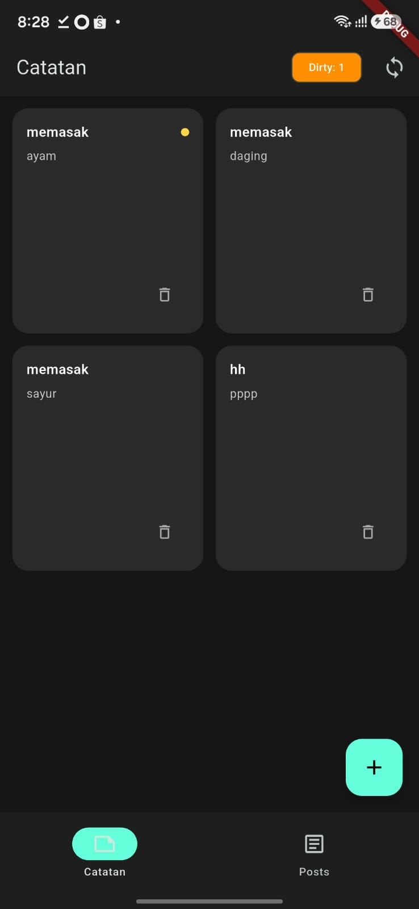 | 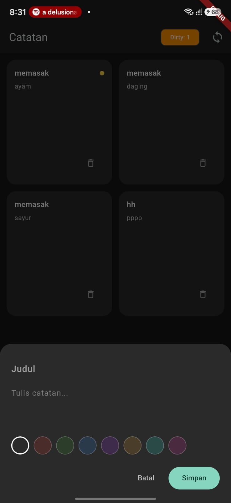 | 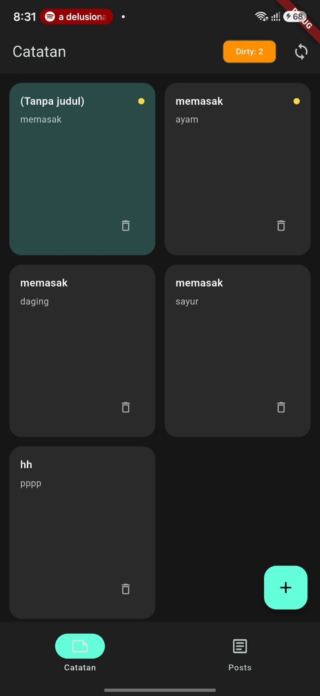 | 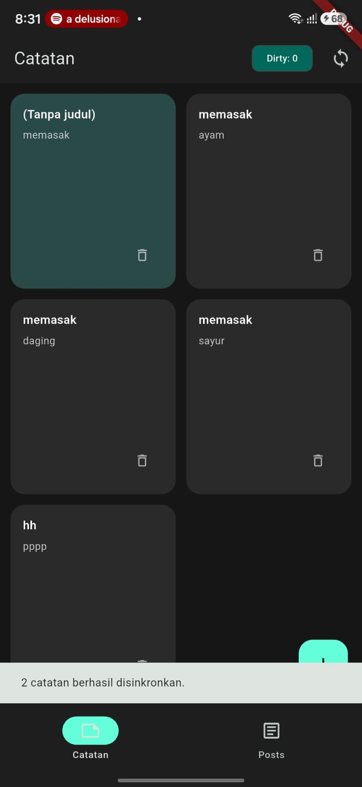 | 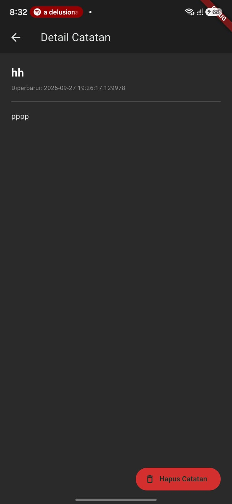 |


---

## Error Umum dan Solusinya

| Gejala | Penyebab Umum | Solusi |
|---|---|---|
| `MissingPluginException` untuk `shared_preferences`/`sqflite` | Hot restart setelah tambah plugin tanpa rebuild penuh | Hentikan aplikasi, jalankan ulang `flutter run` (bukan hot reload) |
| `databaseException: table notes already exists` | `onCreate` dijalankan dua kali / versi tidak naik setelah ubah skema | Naikkan `version` + implementasikan `onUpgrade`, atau uninstall aplikasi saat dev |
| Badge dirty tidak pernah nol | `markAllSynced` tidak dipanggil setelah sync sukses | Panggil hanya setelah "server" menjawab sukses; uji dengan `countDirty` |
| UI tidak refresh setelah tambah catatan | Lupa `ref.invalidate(notesProvider)` setelah mutasi | Invalidasi provider di repository caller, bukan di widget acak |
| Test menyentuh database sungguhan | Repository asli dipakai di test | Gunakan `FakeNoteRepository` via override seperti contoh di atas |

---

## Tugas (Mini Project)

Aplikasi **Offline Notes** dibangun sebagai tugas minggu ini dengan cakupan:

- Preferensi: toggle tema gelap/terang + waktu terakhir dibuka via `SharedPreferences`.
- CRUD catatan persisten via SQLite (`sqflite`) melalui repository lokal + Riverpod; daftar diurutkan `updated_at` terbaru.
- Offline-first: cache-first untuk data bacaan, dirty flag + `syncNotes` untuk tulisan, dan aturan konflik eksplisit (last-write-wins) yang didokumentasikan.
- Bukti mode pesawat: screenshot daftar catatan saat offline dan badge dirty sebelum/sesudah sync.
- Minimal 2 test yang lulus (1 unit test model + 1 test provider dengan repository palsu).

| Catatan | Sebelum Sync | Sesudah Sync | Pengaturan | Detail Catatan |
|---|---|---|---|---|
| 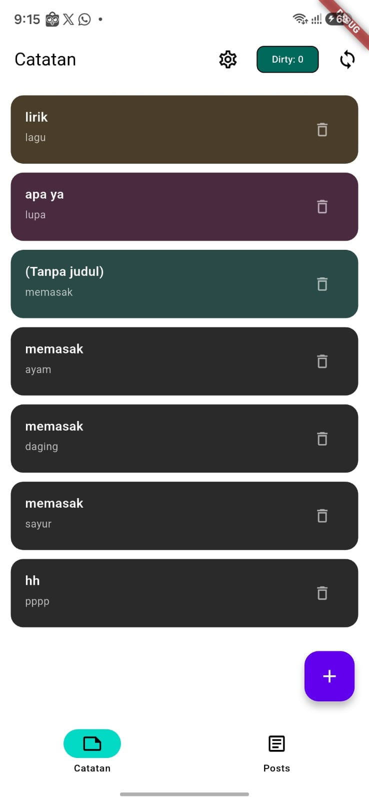 | 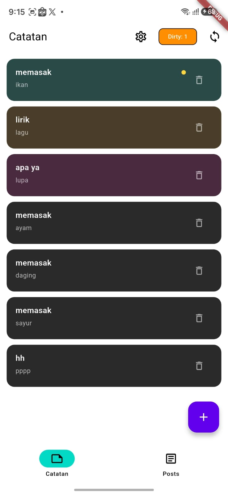 | 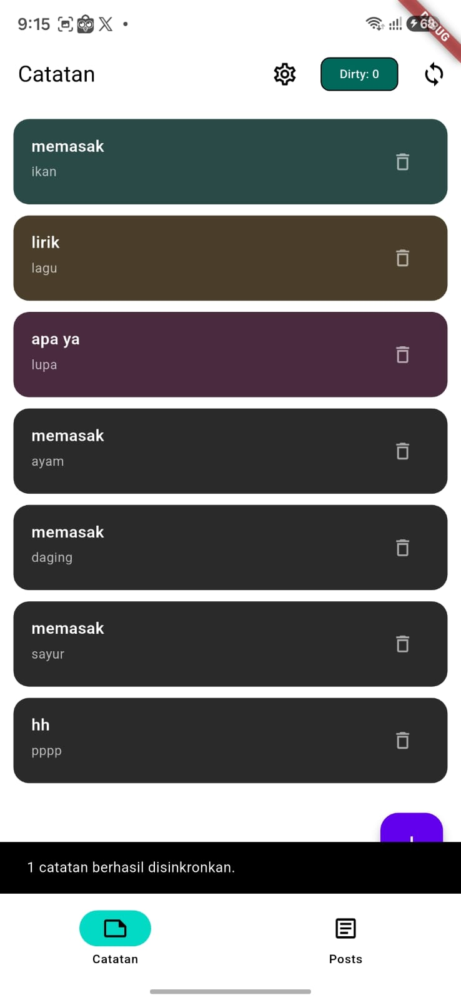 | 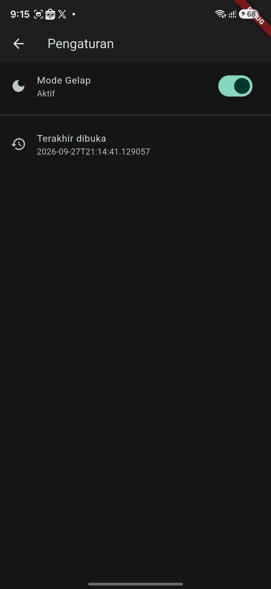 | 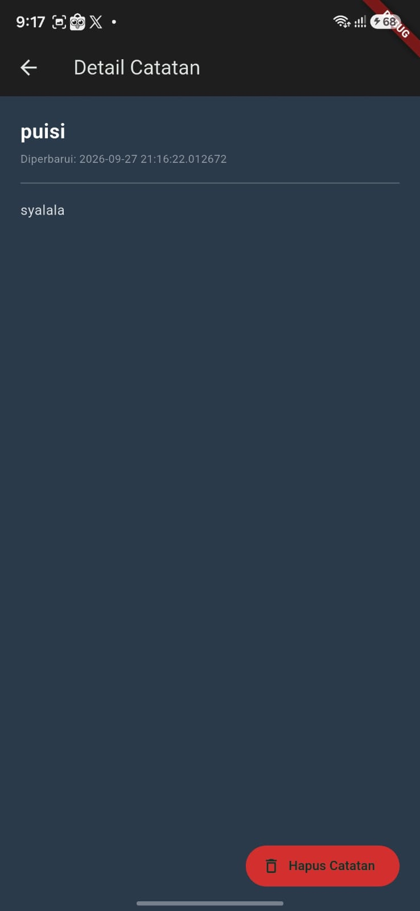 |

---

## Kesimpulan

Pada praktikum ini dipelajari tiga hal utama:

1. **Key-value store vs database relasional** — `SharedPreferences` cocok untuk nilai tunggal seperti preferensi tema, sementara koleksi data seperti catatan yang terus bertambah dan perlu diurutkan wajib disimpan di `SQLite` lewat `sqflite`, dengan `NoteRepository` sebagai satu-satunya pintu akses agar UI tidak pernah menyentuh mekanisme storage secara langsung.
2. **Cache-first untuk data bacaan** — data dari API ditampilkan dulu dari cache lokal (`cached_posts`) agar UI tidak blank saat offline, baru kemudian di-refresh dari jaringan di background.
3. **Dirty flag sebagai antrean sync** — perubahan lokal ditandai `dirty = true` dan baru dibersihkan (`markAllSynced`) setelah proses sinkronisasi ke server benar-benar berhasil, dengan aturan resolusi konflik (*last-write-wins* berdasarkan `updated_at`) yang ditetapkan secara eksplisit agar sinkronisasi dua arah tidak menimpa data secara diam-diam.

---

## Checklist Verifikasi

- [x] UI tidak memanggil `SQLite`/`SharedPreferences` langsung — semua lewat repository + provider.
- [x] Aplikasi penuh berfungsi dalam mode pesawat: baca, tambah, hapus catatan.
- [x] Badge dirty akurat sebelum/sesudah sync; cache posts tampil tanpa internet.
- [x] `flutter analyze` tanpa issue dan semua test lulus.
- [x] Hasil AI diverifikasi dan didokumentasikan pada folder `docs/`.

---

## Refleksi

1. **Mengapa daftar catatan tidak boleh disimpan di `SharedPreferences`? Apa yang rusak jika aturan ini dilanggar?**
   `SharedPreferences` dirancang untuk pasangan key-value tunggal, bukan koleksi data. Jika daftar catatan disimpan di sana (misalnya sebagai satu string JSON besar), setiap kali ada satu catatan ditambah atau dihapus, seluruh list harus dibaca ulang, di-decode, diubah, di-encode lagi, lalu ditulis ulang secara keseluruhan — proses ini tidak efisien dan berisiko korup atau kehilangan data jika proses tertulis sebagian saat aplikasi tiba-tiba ditutup. Selain itu tidak ada mekanisme query, index, atau urutan bawaan, sehingga fitur seperti pengurutan `updated_at DESC` harus dikerjakan manual di memori setiap kali data dibaca.

2. **Kapan cache-first cukup, dan kapan Anda membutuhkan strategi lain (misalnya network-first untuk data harga real-time)?**
   Cache-first cukup untuk data yang bersifat *read-heavy* dan tidak sering berubah, seperti daftar post pada JSONPlaceholder — pengguna lebih diuntungkan melihat sesuatu segera walau sedikit usang, daripada menunggu jaringan. Untuk data yang berubah cepat dan harus selalu akurat, seperti harga saham atau status ketersediaan tiket real-time, strategi *network-first* (atau bahkan *network-only*) lebih tepat, karena data usang pada kasus ini bisa menyesatkan pengguna, bukan sekadar kurang up-to-date.

3. **Bagaimana dirty flag berubah menjadi antrean sync tanpa memblokir UI? Kapan antrean terpisah (tabel outbox) menjadi perlu?**
   Setiap perubahan lokal (tambah/ubah catatan) langsung disimpan ke SQLite dengan `dirty = true` secara instan, sehingga UI tidak pernah menunggu proses jaringan — proses `syncNotes()` berjalan terpisah dan hanya membaca baris-baris yang `dirty` saat dipicu. Tabel outbox terpisah menjadi perlu ketika operasi yang harus disinkron lebih kompleks dari sekadar "kirim state akhir", misalnya perlu mencatat urutan operasi (`insert`, `update`, `delete`) secara individual untuk direplay ke server satu per satu, atau ketika satu entitas bisa memiliki banyak operasi tertunda yang harus diproses berurutan.

4. **Bagian mana dari rekomendasi AI yang Anda tolak, dan mengapa?**
   Rekomendasi utama AI (SharedPreferences untuk preferensi, sqflite untuk catatan) diterima karena sesuai skala codelab ini. Namun saran AI agar mempertimbangkan Drift untuk masa depan tidak langsung diikuti pada tahap ini, karena overhead code generation Drift belum sepadan dengan kebutuhan aplikasi yang masih sederhana (tanpa relasi antar tabel dan belum butuh reaktivitas stream secara nyata) — keputusan ini akan ditinjau ulang bila kebutuhan aplikasi berkembang.