# Pemrograman Mobile

## Praktikum Week 6 - Authentication, Security & Firebase Cloud Messaging (FCM)


## Identitas


| Field    | Detail               |
|----------|-----------------------|
| **Nama** | *Sharren Elvaretta Pratamadya Fianto* |
| **NIM**  | *244107020191* |
| **Kelas** | *TI 3G* |
| **Praktikum 1: Login + secure storage + token refresh** | campus_notify |
| **Praktikum 2: FCM, permission, dan token lifecycle** | campus_notify|
| **Praktikum 3: Payload, tiga app state, klik dan topik** | campus_notify |
| **Tugas Praktikum** | Pertemuan 6 |


---

# Praktikum 1: Login, Secure Storage & Token Refresh

**Project:** `campus_notify`

## Landasan Konsep

Praktikum pertama membahas autentikasi pengguna, penyimpanan token secara aman, serta mekanisme pembaruan access token ketika server mengembalikan HTTP `401 Unauthorized`.

Pada aplikasi mobile, token autentikasi tidak sebaiknya disimpan menggunakan penyimpanan biasa seperti `SharedPreferences`, karena access token dan refresh token merupakan data sensitif. Pada praktikum ini digunakan `flutter_secure_storage` sebagai tempat penyimpanan token.

Arsitektur aplikasi memisahkan tanggung jawab antara UI, provider, repository autentikasi, penyimpanan token, dan API client. Dengan pola ini, widget tidak berinteraksi langsung dengan mekanisme penyimpanan token.

### Arsitektur

```text
UI
 │
 ▼
AuthNotifier (Riverpod)
 │
 ├── AuthRepository
 │
 └── TokenStore
       │
       ▼
flutter_secure_storage

Dio API Client
 │
 ├── Access Token
 │
 └── HTTP 401
       │
       ▼
Refresh Token
       │
       ├── Berhasil → Retry Request
       │
       └── Gagal → Clear Token → Login Ulang
```

---

## Langkah-langkah Praktikum

### Langkah 1 — Membuat Project dan Menambahkan Dependency

```bash
flutter create campus_notify
cd campus_notify

flutter pub add flutter_riverpod go_router dio flutter_secure_storage
flutter pub add firebase_core firebase_messaging flutter_local_notifications
```

Dependency yang digunakan:

* `flutter_riverpod` — state management.
* `go_router` — routing dan route guard.
* `dio` — komunikasi HTTP/API.
* `flutter_secure_storage` — penyimpanan token secara aman.
* `firebase_core` — inisialisasi Firebase.
* `firebase_messaging` — Firebase Cloud Messaging.
* `flutter_local_notifications` — menampilkan notifikasi ketika aplikasi berada pada kondisi foreground.

---

### Langkah 2 — Struktur Folder

```text
lib/
├── main.dart
├── data/
│   ├── auth_repository.dart
│   ├── token_store.dart
│   └── api_client.dart
├── providers/
│   └── auth_provider.dart
├── messaging/
│   └── push_service.dart
└── pages/
    ├── login_page.dart
    ├── home_page.dart
    └── announcement_page.dart
```

Struktur tersebut digunakan untuk memisahkan antara UI, repository, penyimpanan token, state management, API client, dan Firebase Messaging.

---

## 1. Penyimpanan Token yang Aman

Seluruh access token dan refresh token dipusatkan melalui `TokenStore`.

**`lib/data/token_store.dart`**

```dart
import 'package:flutter_secure_storage/flutter_secure_storage.dart';

class TokenStore {
  TokenStore({FlutterSecureStorage? storage})
      : _storage = storage ?? const FlutterSecureStorage();

  final FlutterSecureStorage _storage;

  static const _accessKey = 'access_token';
  static const _refreshKey = 'refresh_token';

  Future<void> save({
    required String access,
    required String refresh,
  }) async {
    await _storage.write(key: _accessKey, value: access);
    await _storage.write(key: _refreshKey, value: refresh);
  }

  Future<String?> readAccess() {
    return _storage.read(key: _accessKey);
  }

  Future<String?> readRefresh() {
    return _storage.read(key: _refreshKey);
  }

  Future<void> clear() {
    return _storage.deleteAll();
  }
}
```

Dengan pendekatan ini, UI tidak perlu mengetahui bagaimana token disimpan secara internal.

---

## 2. Repository Authentication

Repository digunakan sebagai abstraction layer untuk proses login dan refresh token.

**`lib/data/auth_repository.dart`**

```dart
class AuthSession {
  const AuthSession({
    required this.access,
    required this.refresh,
  });

  final String access;
  final String refresh;
}

class AuthRepository {
  Future<AuthSession> login({
    required String email,
    required String password,
  }) async {
    await Future.delayed(
      const Duration(milliseconds: 500),
    );

    if (!email.contains('@') || password.length < 6) {
      throw Exception('Email atau kata sandi tidak valid');
    }

    return AuthSession(
      access: 'mock-access-for-$email',
      refresh: 'mock-refresh-for-$email',
    );
  }

  Future<String> refresh(String refreshToken) async {
    await Future.delayed(
      const Duration(milliseconds: 300),
    );

    if (refreshToken.isEmpty) {
      throw Exception('Refresh token hilang');
    }

    return 'mock-access-renewed-${DateTime.now().millisecondsSinceEpoch}';
  }
}
```

Pada tahap ini autentikasi masih menggunakan mekanisme mock sehingga dapat diganti dengan Firebase Authentication atau backend autentikasi yang sebenarnya.

---

## 3. Dio dengan Automatic Token Refresh

API client menggunakan interceptor Dio untuk:

1. Menambahkan access token pada setiap request.
2. Mendeteksi response `401`.
3. Mengambil refresh token.
4. Meminta access token baru.
5. Mengulangi request satu kali.
6. Menghapus sesi jika refresh gagal.

```dart
import 'package:dio/dio.dart';

import 'auth_repository.dart';
import 'token_store.dart';

Dio buildApiClient(
  TokenStore store,
  AuthRepository auth,
) {
  final dio = Dio(
    BaseOptions(
      baseUrl: 'https://example-campus-api.test',
    ),
  );

  dio.interceptors.add(
    InterceptorsWrapper(
      onRequest: (options, handler) async {
        final access = await store.readAccess();

        if (access != null) {
          options.headers['Authorization'] = 'Bearer $access';
        }

        handler.next(options);
      },
      onError: (e, handler) async {
        if (e.response?.statusCode == 401) {
          final refresh = await store.readRefresh();

          if (refresh == null) {
            return handler.next(e);
          }

          try {
            final renewed = await auth.refresh(refresh);

            await store.save(
              access: renewed,
              refresh: refresh,
            );

            final retry = await dio.fetch(
              e.requestOptions
                ..headers['Authorization'] = 'Bearer $renewed',
            );

            return handler.resolve(retry);
          } catch (_) {
            await store.clear();
          }
        }

        handler.next(e);
      },
    ),
  );

  return dio;
}
```

### Alur Refresh Token

```text
Request API
    │
    ▼
Access Token
    │
    ▼
Server
    │
    ├── 200 → Response
    │
    └── 401
         │
         ▼
    Refresh Token
         │
    ├── Berhasil
    │      │
    │      ▼
    │   Access Token Baru
    │      │
    │      ▼
    │   Retry Request
    │
    └── Gagal
           │
           ▼
       Clear Session
           │
           ▼
        Login Ulang
```

---

## 4. Provider Authentication dan Route Guard

Authentication state dikelola menggunakan Riverpod.

```dart
final authStateProvider =
    AsyncNotifierProvider<AuthNotifier, bool>(
  AuthNotifier.new,
);

class AuthNotifier extends AsyncNotifier<bool> {
  @override
  Future<bool> build() async {
    final token =
        await ref.watch(tokenStoreProvider).readAccess();

    return token != null;
  }

  Future<void> login(
    String email,
    String password,
  ) async {
    state = const AsyncLoading();

    state = await AsyncValue.guard(() async {
      final session = await ref
          .read(authRepositoryProvider)
          .login(
            email: email,
            password: password,
          );

      await ref
          .read(tokenStoreProvider)
          .save(
            access: session.access,
            refresh: session.refresh,
          );

      return true;
    });
  }

  Future<void> logout() async {
    await ref.read(tokenStoreProvider).clear();
    ref.invalidateSelf();
  }
}
```

### Route Guard

```dart
GoRouter(
  redirect: (context, state) {
    final loggedIn =
        container.read(authStateProvider).value ?? false;

    final goingLogin =
        state.matchedLocation == '/login';

    if (!loggedIn && !goingLogin) {
      return '/login';
    }

    if (loggedIn && goingLogin) {
      return '/';
    }

    return null;
  },
  routes: [
    GoRoute(
      path: '/login',
      builder: (_, __) => const LoginPage(),
    ),
    GoRoute(
      path: '/',
      builder: (_, __) => const HomePage(),
    ),
    GoRoute(
      path: '/pengumuman/:id',
      builder: (_, state) {
        return AnnouncementPage(
          id: state.pathParameters['id'] ?? '',
        );
      },
    ),
  ],
)
```

---

## Hasil Praktikum 1

| Login                                      | Home Page                                | Pengumuman                                           |
| ------------------------------------------ | ---------------------------------------- | ---------------------------------------------------- |
| 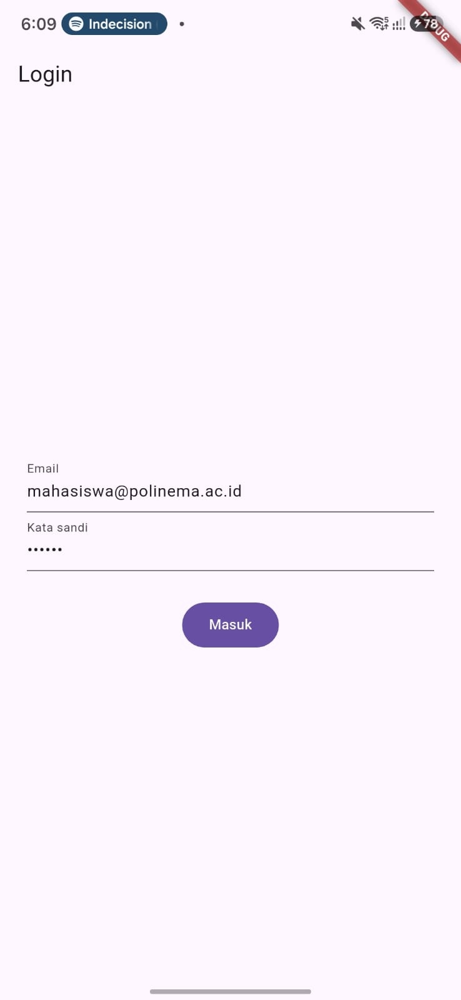 | 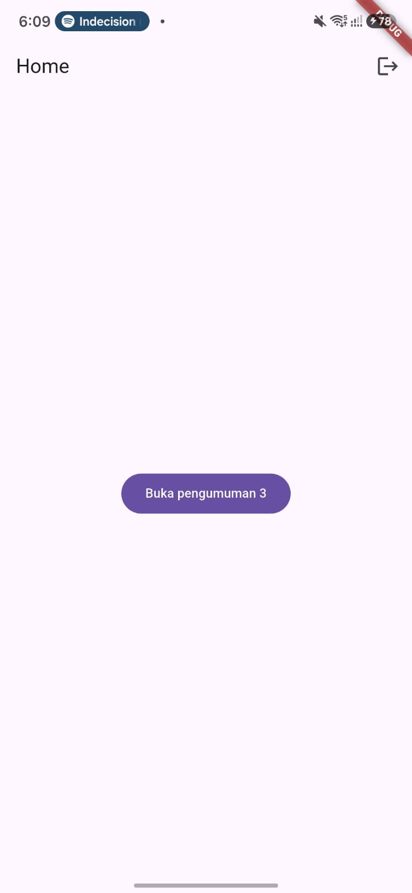 | 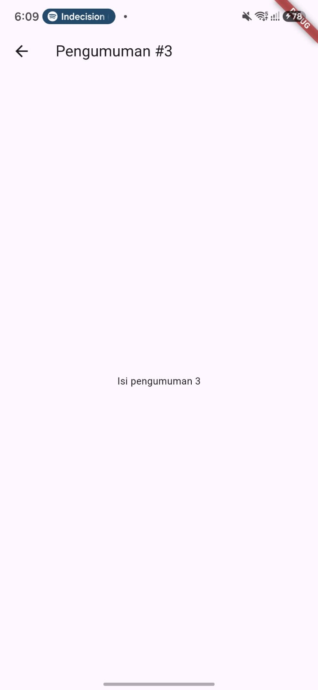 |


---

# Praktikum 2: FCM, Permission dan Token Lifecycle

**Project:** lanjutan `campus_notify`

## Landasan Konsep

Praktikum kedua mengintegrasikan Firebase Cloud Messaging atau FCM ke aplikasi Flutter.

Tahapan utama yang dipelajari:

* Registrasi aplikasi ke Firebase.
* Inisialisasi Firebase.
* Permission notifikasi.
* Pengambilan FCM token.
* Pengiriman token ke backend.
* Pemantauan perubahan token.
* Subscription ke topic.

---

## 1. Registrasi Firebase

Project Flutter didaftarkan pada Firebase Console.

Untuk Android:

```text
Firebase Console
      │
      ▼
Create Firebase Project
      │
      ▼
Add Android App
      │
      ▼
Masukkan applicationId
      │
      ▼
Download google-services.json
      │
      ▼
android/app/
```

File `google-services.json` diletakkan pada:

```text
android/app/google-services.json
```

Firebase kemudian diinisialisasi sebelum `runApp()`:

```dart
await Firebase.initializeApp();
```

---

## 2. Meminta Permission Notifikasi

**`lib/messaging/push_service.dart`**

```dart
import 'package:firebase_messaging/firebase_messaging.dart';
import 'package:flutter_local_notifications/flutter_local_notifications.dart';

final _local = FlutterLocalNotificationsPlugin();

Future<bool> requestNotificationPermission() async {
  final settings =
      await FirebaseMessaging.instance.requestPermission(
    alert: true,
    badge: true,
    sound: true,
    announcement: false,
    carPlay: false,
    criticalAlert: false,
  );

  return settings.authorizationStatus ==
          AuthorizationStatus.authorized ||
      settings.authorizationStatus ==
          AuthorizationStatus.provisional;
}
```

Permission diperlukan terutama pada Android 13+ dan iOS.

---

## 3. Local Notification

```dart
Future<void> initLocalNotifications() async {
  const android =
      AndroidInitializationSettings('@mipmap/ic_launcher');

  const ios = DarwinInitializationSettings();

  await _local.initialize(
    const InitializationSettings(
      android: android,
      iOS: ios,
    ),
    onDidReceiveNotificationResponse: (response) {
      pendingDeepLink = response.payload;
    },
  );
}

String? pendingDeepLink;
```

Local notification digunakan agar aplikasi tetap dapat menampilkan notifikasi ketika berada pada kondisi foreground.

---

## 4. Token Lifecycle

FCM token tidak boleh dianggap permanen karena dapat berubah setelah reinstall, clear data, atau perubahan keamanan perangkat.

```dart
Future<void> initFcmToken({
  required Future<void> Function(String token) onToken,
}) async {
  final token =
      await FirebaseMessaging.instance.getToken();

  if (token != null) {
    await onToken(token);
  }

  FirebaseMessaging.instance.onTokenRefresh.listen(
    onToken,
  );

  await FirebaseMessaging.instance
      .subscribeToTopic('pengumuman-kampus');
}
```

Token kemudian dapat dikirim ke backend:

```dart
await initFcmToken(
  onToken: (token) async {
    await dio.post(
      '/devices',
      data: {
        'fcm_token': token,
        'platform': 'android',
      },
    );
  },
);
```

### Catatan Keamanan

Token tidak boleh ditampilkan secara penuh pada screenshot laporan.

Contoh tampilan yang aman:

```text
FCM Token:
f7x9Ab12Cd34...
```

---

## 5. Pengujian Firebase Console

Pengujian dilakukan melalui Firebase Console:

```text
Firebase Console
      ↓
Messaging
      ↓
Create Campaign
      ↓
Notification
      ↓
Title + Body
      ↓
Target Application
      ↓
Send
```

Notifikasi diuji ketika aplikasi berada dalam kondisi background.

---

## Hasil Praktikum 2

| Permission                                           | FCM Token                                                                         |
| ---------------------------------------------------- | ---------------------------------------------- | 
| 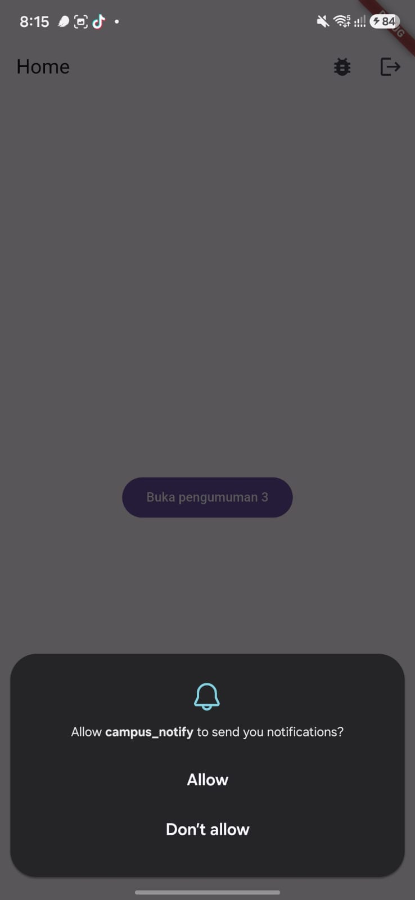              | 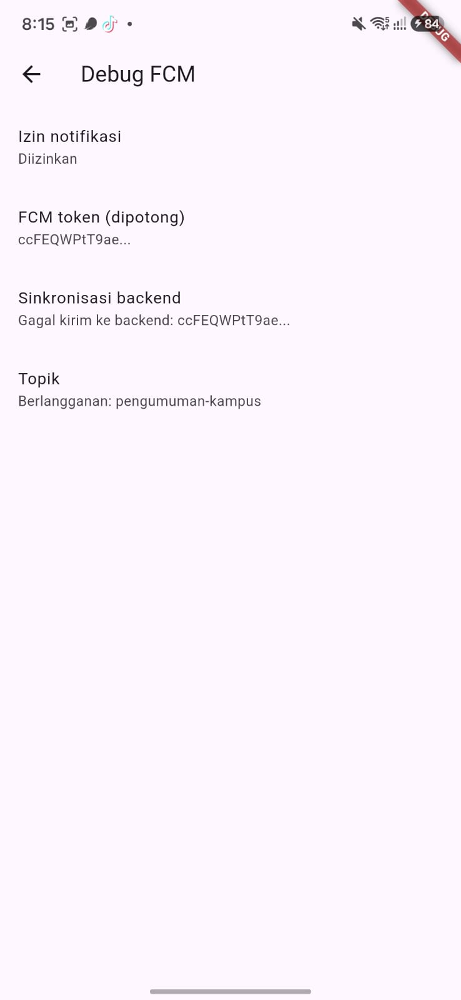    |

---

# Praktikum 3: Payload, App State, Deep Link dan Topic

**Project:** lanjutan `campus_notify`

## Landasan Konsep

Praktikum ketiga membahas lifecycle notifikasi pada tiga kondisi aplikasi:

1. Foreground.
2. Background.
3. Terminated.

Selain itu, payload FCM digunakan untuk membawa informasi tujuan navigasi melalui `data.route`.

---

## 1. Background Handler

Background handler harus berupa fungsi top-level karena dapat dijalankan pada isolate terpisah.

```dart
@pragma('vm:entry-point')
Future<void> firebaseMessagingBackgroundHandler(
  RemoteMessage message,
) async {
  // Tidak menggunakan BuildContext / Riverpod.
}

void registerBackgroundHandler() {
  FirebaseMessaging.onBackgroundMessage(
    firebaseMessagingBackgroundHandler,
  );
}
```

---

## 2. Payload FCM

Contoh payload:

```json
{
  "message": {
    "topic": "pengumuman-kampus",
    "notification": {
      "title": "Jadwal kuliah berubah",
      "body": "Kelas Mobile pindah ke Ruang A2 jam 13.00"
    },
    "data": {
      "route": "/pengumuman/3",
      "id": "3"
    }
  }
}
```

Field `route` digunakan untuk menentukan halaman tujuan ketika pengguna menekan notifikasi.

---

## 3. Foreground Notification

Ketika aplikasi berada dalam kondisi foreground, banner sistem tidak otomatis ditampilkan sehingga local notification digunakan.

```dart
void listenForeground(
  void Function(String route) go,
) {
  FirebaseMessaging.onMessage.listen(
    (message) async {
      final route =
          message.data['route'] ?? '/';

      const androidDetails =
          AndroidNotificationDetails(
        'pengumuman',
        'Pengumuman Kampus',
        importance: Importance.high,
        priority: Priority.high,
      );

      await _local.show(
        message.hashCode,
        message.notification?.title ??
            'Pengumuman',
        message.notification?.body ?? '',
        const NotificationDetails(
          android: androidDetails,
        ),
        payload: route,
      );
    },
  );
}
```

---

## 4. Background Notification

Ketika aplikasi berada pada background dan pengguna menekan banner:

```dart
FirebaseMessaging.onMessageOpenedApp.listen(
  (message) {
    go(
      message.data['route'] ?? '/',
    );
  },
);
```

---

## 5. Terminated Notification

Ketika aplikasi sebelumnya benar-benar ditutup:

```dart
Future<void> handleTerminated(
  void Function(String route) go,
) async {
  final initial =
      await FirebaseMessaging.instance
          .getInitialMessage();

  if (initial != null) {
    go(
      initial.data['route'] ?? '/',
    );
  }

  if (pendingDeepLink != null) {
    go(pendingDeepLink!);
  }
}
```

---

### Bukti Pengujian

| FCM                                       | FCM                                       | 
| ----------------------------------------- | ----------------------------------------- |
| 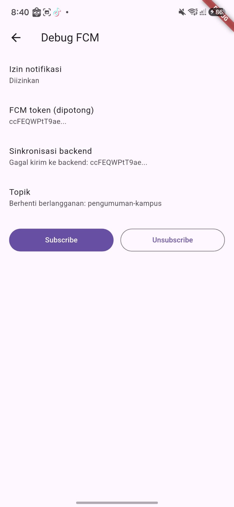      | 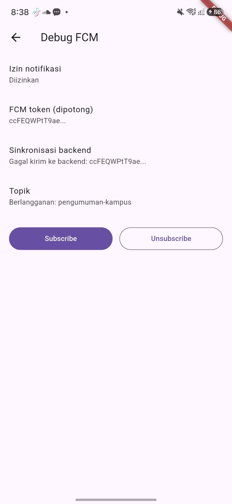  |

---

# Topic Messaging

Topic digunakan untuk kebutuhan broadcast kepada banyak perangkat.

```dart
await FirebaseMessaging.instance
    .subscribeToTopic('pengumuman-kampus');

await FirebaseMessaging.instance
    .unsubscribeFromTopic('pengumuman-kampus');
```

### Penggunaan Topic

Contoh penggunaan:

* Pengumuman seluruh mahasiswa.
* Pengumuman satu kelas.
* Pengumuman UKM.
* Informasi kegiatan kampus.

Untuk pesan yang bersifat personal seperti nilai atau tagihan, digunakan **device token**, bukan topic.

---

# AI Challenge

## Peran AI pada Praktikum

AI digunakan sebagai coding assistant untuk membuat draft awal `PushService` dan boilerplate authentication.

Namun, hasil dari AI tetap diverifikasi secara manual karena beberapa bug pada sistem FCM tidak dapat diketahui hanya dengan membaca kode.

Contohnya:

* Token menjadi basi.
* Navigasi deep link salah.
* Banner notifikasi muncul dua kali.
* Background handler tidak berjalan.
* Token baru tidak dikirim kembali ke backend.

---

## Prompt yang Digunakan

```text
Aplikasi Flutter Campus Notification App.

Stack:
- firebase_messaging
- flutter_local_notifications
- flutter_secure_storage
- go_router
- Riverpod

Buatkan PushService dengan:
- requestPermission
- getToken
- onTokenRefresh yang mengirim token ke POST /devices
- onMessage untuk menampilkan local notification manual
- onMessageOpenedApp untuk navigasi ke data.route
- getInitialMessage untuk navigasi ketika aplikasi dibuka dari terminated state
- subscribe/unsubscribe topic pengumuman-kampus
- background handler top-level dengan @pragma('vm:entry-point')

Tandai bagian yang berbeda untuk Android 13+ dan iOS.

Tandai bagian yang tidak boleh mengakses BuildContext.
```

---

# AI Verification Checklist

* [x] Background handler berupa fungsi top-level dengan `@pragma('vm:entry-point')`.
* [x] `onTokenRefresh` digunakan untuk menangani perubahan token.
* [x] Foreground menggunakan local notification secara manual.
* [x] Deep link diuji pada foreground, background, dan terminated.
* [x] Token dan secret tidak di-hardcode.
* [x] Token tidak ditampilkan secara penuh pada screenshot.
* [x] Topic digunakan untuk kebutuhan broadcast.
* [x] Device token digunakan untuk pesan personal.

### Keputusan Final

Hasil dari AI tidak langsung diterima seluruhnya. Setiap bagian yang berkaitan dengan authentication, token lifecycle, notification lifecycle, dan deep linking tetap diuji secara manual.

Keputusan akhir diambil berdasarkan hasil implementasi dan pengujian aplikasi.

---

# Refactoring dan Testing

## Refactoring

Beberapa bagian aplikasi dipisahkan agar lebih mudah dipelihara.

### 1. Centralized Routes

String route dipusatkan pada satu file:

```text
lib/routes.dart
```

Contoh:

```dart
class AppRoutes {
  static const login = '/login';
  static const home = '/';
  static const announcement = '/pengumuman/:id';
}
```

Tujuannya agar deep link dari FCM dan GoRouter menggunakan sumber route yang sama.

---

## 2. Parsing Route

Parsing payload FCM dipisahkan ke fungsi murni:

```dart
String routeFromMessage(
  Map<String, String> data,
) {
  final route = data['route'] ?? '/';

  return route.startsWith('/')
      ? route
      : '/$route';
}
```

Fungsi tersebut dapat diuji tanpa Firebase.

---

## 3. Error Handling Dio

Pemetaan error API dipisahkan agar UI tidak menerima exception mentah.

Contoh kategori error:

```text
401        → Sesi berakhir
Timeout    → Koneksi terlalu lama
Offline    → Tidak ada koneksi internet
Unknown    → Terjadi kesalahan
```

---

# Unit Testing

Pengujian dilakukan tanpa Firebase sungguhan dengan menguji logika yang berada di sekitar Firebase.

### Contoh Test Route

```dart
test(
  'routeFromMessage menangani route kosong dan tanpa slash',
  () {
    expect(
      routeFromMessage({}),
      '/',
    );

    expect(
      routeFromMessage({
        'route': 'pengumuman/3',
      }),
      '/pengumuman/3',
    );

    expect(
      routeFromMessage({
        'route': '/pengumuman/3',
      }),
      '/pengumuman/3',
    );
  },
);
```

### Test Payload

```dart
test(
  'data payload membawa id pengumuman',
  () {
    const data = {
      'route': '/pengumuman/3',
      'id': '3',
    };

    expect(data['id'], '3');

    expect(
      routeFromMessage(data),
      '/pengumuman/3',
    );
  },
);
```

### Test Authentication

```dart
test(
  'provider auth membaca status login dari token',
  () async {
    final store =
        FakeTokenStore()..access = 'mock-access';

    expect(
      store.access != null,
      isTrue,
    );

    store.access = null;

    expect(
      store.access != null,
      isFalse,
    );
  },
);
```

### Test Refresh Token

```dart
test(
  'refresh gagal -> sesi dibersihkan',
  () async {
    final store =
        FakeTokenStore()..refresh = '';

    final needsLogin =
        (store.refresh ?? '').isEmpty;

    expect(
      needsLogin,
      isTrue,
    );
  },
);
```

---

# Menjalankan Testing

```bash
flutter analyze
flutter test
```

Hasil yang diharapkan:

```text
flutter analyze
No issues found.

flutter test
All tests passed.
```

---

# Error Umum dan Solusinya

| Gejala                                   | Penyebab Umum                                            | Solusi                                                        |
| ---------------------------------------- | -------------------------------------------------------- | ------------------------------------------------------------- |
| `Token null` pada emulator               | Emulator tidak memiliki Google Play Services             | Gunakan emulator dengan Play Store atau perangkat fisik       |
| Banner tidak muncul saat foreground      | Mengandalkan banner otomatis sistem                      | Gunakan `flutter_local_notifications` pada `onMessage`        |
| Klik notifikasi tidak melakukan navigasi | `getInitialMessage()` tidak dipanggil                    | Panggil ketika aplikasi melakukan startup                     |
| `401` terus berulang                     | Request tidak diulang setelah refresh                    | Retry request satu kali setelah mendapatkan access token baru |
| `MissingPluginException`                 | Plugin baru ditambahkan tetapi aplikasi hanya hot reload | Hentikan aplikasi lalu jalankan kembali                       |
| Notifikasi iOS tidak muncul              | APNs belum dikonfigurasi                                 | Konfigurasi APNs dan Push Notification capability             |
| Token lama tersimpan di backend          | `onTokenRefresh` tidak dipantau                          | Gunakan listener `onTokenRefresh`                             |

---

# Checklist Verifikasi Mandiri

* [x] Token disimpan menggunakan `flutter_secure_storage`.
* [x] Access token digunakan untuk request API.
* [x] HTTP `401` memicu refresh token.
* [x] Request diulang setelah refresh berhasil.
* [x] Refresh token yang gagal menyebabkan sesi dibersihkan.
* [x] Authentication menggunakan route guard.
* [x] Permission notification diterapkan.
* [x] FCM token berhasil diperoleh.
* [x] `onTokenRefresh` digunakan.
* [x] Topic `pengumuman-kampus` berhasil digunakan.
* [x] Foreground notification diuji.
* [x] Background notification diuji.
* [x] Terminated notification diuji.
* [x] Deep link menuju `/pengumuman/:id` diuji.
* [x] Unit test dijalankan.
* [x] `flutter analyze` dijalankan.
* [x] Token penuh tidak ditampilkan pada screenshot.

---

# Tugas Praktikum / Mini Project

## Campus Notification App

Mini project pada Week 6 dikembangkan menjadi aplikasi **Campus Notification App** dengan fitur authentication, secure storage, token refresh, dan Firebase Cloud Messaging.

Fitur utama:

* Login menggunakan mock authentication atau Firebase Auth.
* Route guard untuk halaman yang membutuhkan authentication.
* Access token dan refresh token disimpan menggunakan secure storage.
* Dio melakukan automatic token refresh ketika mendapatkan `401`.
* Sesi dihapus apabila refresh token sudah tidak valid.
* Firebase Cloud Messaging terintegrasi.
* Permission notification.
* Pengambilan FCM token.
* `onTokenRefresh`.
* Pengiriman token ke endpoint backend `/devices`.
* Subscription topic `pengumuman-kampus`.
* Notification payload menggunakan kombinasi `notification` dan `data`.
* Deep link menuju `/pengumuman/:id`.
* Pengujian foreground, background, dan terminated.
* Unit testing untuk parsing route dan authentication logic.
* Dokumentasi AI Challenge.

---

## Screenshot Hasil Tugas

| Login                                 | Home                                | Pengumuman                                      |
| ------------------------------------- | ----------------------------------- | ----------------------------------------------- |
| 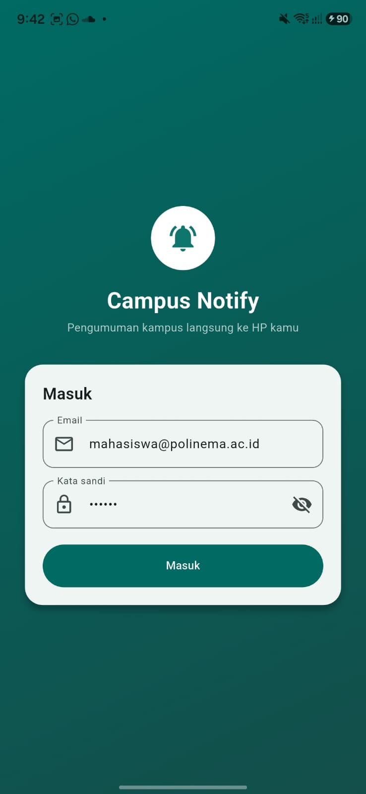 | 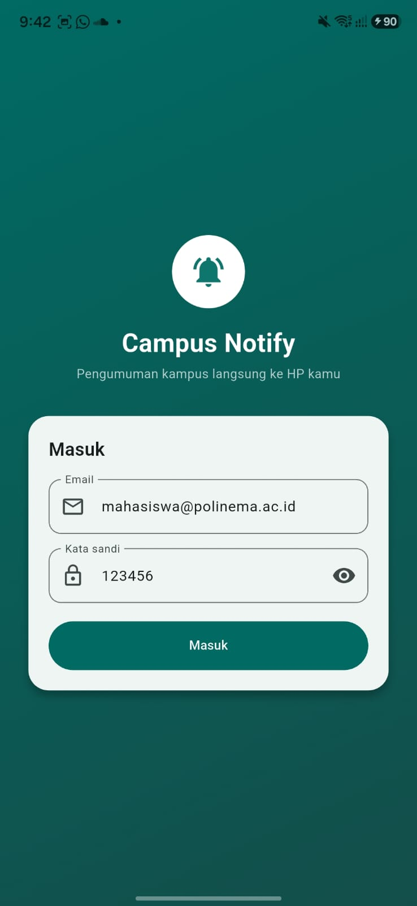 | 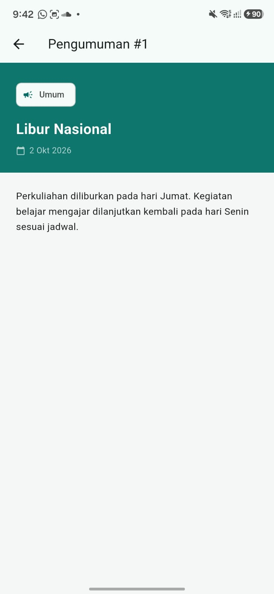 |

| FCM Permission                                  | FCM Token                             | Notification                                        |
| ----------------------------------------------- | ------------------------------------- | --------------------------------------------------- |
|  | 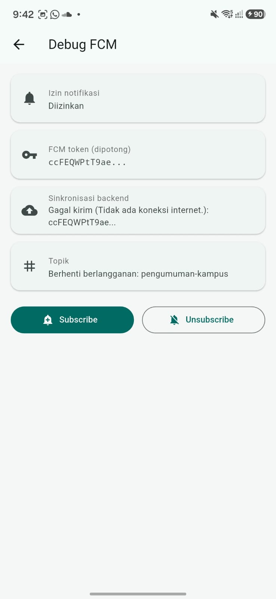 |  |

---

# Struktur Repository

```text
06-week-6-authentication-security-fcm/
│
├── lib/
│   ├── main.dart
│   ├── routes.dart
│   ├── data/
│   │   ├── auth_repository.dart
│   │   ├── token_store.dart
│   │   ├── api_client.dart
│   │   └── api_errors.dart
│   │
│   ├── providers/
│   │   └── auth_provider.dart
│   │
│   ├── messaging/
│   │   └── push_service.dart
│   │
│   └── pages/
│       ├── login_page.dart
│       ├── home_page.dart
│       └── announcement_page.dart
│
├── test/
│   └── auth_push_test.dart
│
├── docs/
│   ├── ai-prompt.md
│   └── ai-verification.md
│
├── screenshots/
│   ├── Praktikum1_Login.png
│   ├── Praktikum1_Home.png
│   ├── Praktikum1_Pengumuman.png
│   ├── Praktikum2_Permission.png
│   ├── Praktikum2_Token.png
│   ├── Praktikum2_Firebase.png
│   ├── Foreground.png
│   ├── Background.png
│   └── Terminated.png
│
└── README.md
```

---

# Kesimpulan

Pada Week 6 dipelajari implementasi authentication, secure storage, token refresh, dan Firebase Cloud Messaging pada aplikasi Flutter.

Pertama, authentication dan token management diterapkan dengan memisahkan `AuthRepository`, `TokenStore`, dan `Dio API Client`. Access token digunakan untuk request API, sedangkan refresh token digunakan untuk mendapatkan access token baru ketika server mengembalikan `401 Unauthorized`.

Kedua, token autentikasi disimpan menggunakan `flutter_secure_storage` agar tidak diletakkan pada penyimpanan biasa. Mekanisme refresh juga memastikan aplikasi dapat mempertahankan sesi selama refresh token masih valid.

Ketiga, Firebase Cloud Messaging digunakan untuk menerima push notification. Aplikasi menangani permission, pengambilan FCM token, perubahan token melalui `onTokenRefresh`, serta subscription ke topic.

Keempat, lifecycle notification diuji pada tiga kondisi aplikasi yaitu **foreground, background, dan terminated**. Payload `data.route` digunakan untuk menentukan halaman tujuan sehingga pengguna dapat langsung diarahkan ke halaman pengumuman tertentu.

Terakhir, dilakukan refactoring dan unit testing terhadap logika yang berada di sekitar Firebase. Pengujian tersebut memastikan parsing route, authentication state, dan mekanisme refresh dapat diverifikasi tanpa harus selalu menggunakan Firebase secara langsung.

---

# Refleksi

### 1. Mengapa refresh token tidak boleh disimpan di SharedPreferences? Apa risikonya bila bocor?

Refresh token merupakan kredensial yang memiliki masa berlaku lebih panjang dan dapat digunakan untuk memperoleh access token baru. Karena sifatnya sensitif, refresh token tidak sebaiknya disimpan menggunakan penyimpanan biasa seperti `SharedPreferences`.

Jika refresh token bocor, pihak yang memperoleh token tersebut berpotensi mempertahankan akses ke akun sampai token dicabut atau kedaluwarsa. Oleh karena itu, token perlu disimpan menggunakan mekanisme secure storage dan tidak boleh ditampilkan secara penuh pada log maupun screenshot laporan.

### 2. Apa yang rusak bila `onTokenRefresh` diabaikan selama satu semester?

FCM token dapat berubah karena reinstall aplikasi, clear data, atau perubahan tertentu pada perangkat. Jika perubahan token tidak dikirim ke backend, server dapat menyimpan token lama.

Akibatnya, pengiriman notification dapat gagal karena backend masih mencoba mengirim pesan menggunakan token yang sudah tidak berlaku.

### 3. Kapan menggunakan topic dan kapan menggunakan device token?

Topic digunakan untuk pesan broadcast kepada kelompok pengguna.

Contohnya:

```text
pengumuman-kampus
```

Topic dapat digunakan untuk pengumuman seluruh mahasiswa atau kelompok tertentu.

Sebaliknya, device token digunakan untuk pesan yang bersifat personal, misalnya:

```text
Pemberitahuan nilai mahasiswa
Tagihan UKT
Informasi akun pribadi
```

Pesan personal tidak sebaiknya dikirim menggunakan topic karena topic ditujukan untuk broadcast.

### 4. Bagian mana dari draf AI yang diperbaiki?

Draf AI tidak langsung digunakan tanpa pengujian. Bagian yang berkaitan dengan background handler, `onTokenRefresh`, foreground notification, deep link, serta authentication lifecycle diverifikasi kembali secara manual.

Perbaikan dilakukan apabila implementasi AI tidak sesuai dengan lifecycle Firebase Messaging atau berpotensi menimbulkan masalah keamanan seperti hardcode token, logging token penuh, atau navigasi yang tidak berjalan pada kondisi terminated.

---
